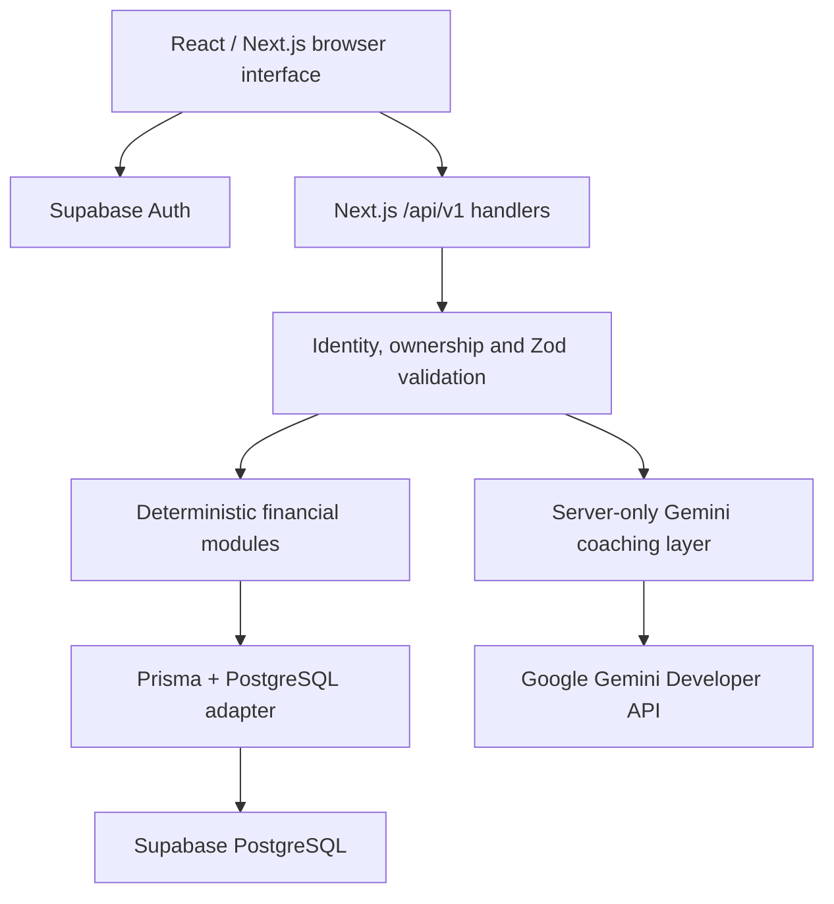
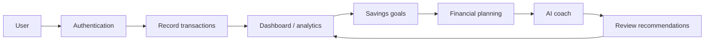
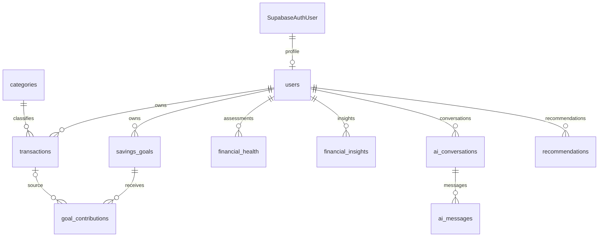

# UPAY AI Financial Coach

**Final Project Report**

AI-Powered Personal Financial Management and Decision-Support Prototype

Live Application: https://upay-ai-hackathon.vercel.app/

Team Name: [Team Name]

Team Members: [Team Members]

Institution: [Institution]

Hackathon/Event: [Hackathon/Event]

Submission Date: [Submission Date]

This report documents the inspected repository as of 3 October 2026. It describes a prototype based on user-recorded financial data, without a live Upay wallet connection or official Upay endorsement.

<!-- PAGE BREAK -->

# Table of Contents

[TOC]

Report organization: the cover is Section 1; numbered technical sections run from 2 to 15. Core implementation is grouped into nine modules in Section 8. Three diagrams summarize architecture, workflow and database relationships. Seven compact screenshot placeholders identify evidence to add before submission.

Evidence policy: implementation claims are grounded in the current source, not promotional material. Test outcomes are reported only where observed during this session. Configured build, browser and smoke procedures are distinguished from executed checks. The supplied production URL identifies the application; production configuration and authenticated production behavior were not independently audited.

<!-- PAGE BREAK -->

# 2. Executive Summary

Personal financial records are often fragmented across income entries, spending notes and savings intentions. Recording transactions alone does not explain whether a savings target is realistic, how spending patterns affect progress, or what funds should be protected before a purchase. Users need a clear connection between their records and the decisions they make.

UPAY AI Financial Coach addresses this problem through an integrated personal financial management and decision-support prototype. Users can register, record income and expenses, manage savings goals and contributions, review a dashboard, analyze category spending and monthly trends, and explore savings or purchase scenarios. Financial wellness combines four illustrative components: savings, spending, goal progress and emergency coverage. Current assessments can be saved for historical comparison.

The project separates deterministic calculation from generative explanation. Backend modules calculate balances, goal progress, required monthly saving, wellness scores, spending-reduction plans, savings projections and affordability verdicts. Google Gemini receives minimized, precomputed financial context and limited conversation history to produce natural-language coaching and qualitative recommendations. English, Bangla and Banglish are supported, with structured response validation and a Latin-script check for Banglish. Optional AI affordability explanations describe an already calculated assessment.

The implementation uses Next.js App Router, React and TypeScript for the interface and API handlers; Supabase Auth for identity; PostgreSQL and Prisma for persistence; Zod for validation; and custom CSS and SVG for presentation. The repository points to GitHub version control and documents a Vercel deployment with Supabase services. Vitest and Playwright provide mocked and fixture-backed verification paths. During report preparation, 222 tests across 23 Vitest files passed; earlier checks in this session passed TypeScript and completed ESLint with five existing warnings.

The resulting prototype demonstrates an end-to-end journey from recorded activity to understandable financial guidance. It does not synchronize an Upay wallet, verify liquid funds, execute payments, determine creditworthiness or replace professional advice. Its value is a transparent combination of financial calculations, goal tracking and multilingual explanation.

# 3. Introduction & Problem Statement

The project is motivated by a practical gap: people may know individual income and spending amounts but lack a consolidated view of cash flow, savings commitments and purchase capacity. A ledger can show what happened; financial intelligence also helps explain patterns and compare possible next steps.

The proposed solution brings records, goals, analytics, planning and coaching into one authenticated workspace. BDT presentation and Asia/Dhaka date handling support the local use context. AI is used to make supplied financial facts easier to understand and to offer qualitative budgeting suggestions; reproducible numerical decisions remain in application code.

[Insert Figure: Home Page]

Figure 1. Public landing page introducing the prototype and account entry points.

<!-- PAGE BREAK -->

# 4. Objectives, Scope & Requirements

The main objective is to turn user-recorded financial activity into understandable analysis, trackable savings goals and informed planning scenarios, supported by multilingual AI guidance.

Specific objectives are to maintain an owned financial record, calculate transparent summaries, support goal contributions and deadlines, compare saving and purchase scenarios, and retain coaching conversations and actionable recommendations. Intended users include individuals learning to manage everyday finances and hackathon evaluators reviewing a complete fintech prototype.

Table 1. Compact requirements and implementation scope.

| Requirement | Implemented scope |
| --- | --- |
| Account access | Email/password signup/login, conditional confirmation callback, restored sessions and local sign-out. |
| Financial records | Category-based income/expense CRUD, search, type/category/date filters and pagination. |
| Savings management | Goals, contributions, progress, monthly requirements and eligible lifecycle changes. |
| Financial intelligence | Dashboard, spending analytics, current/saved wellness and deterministic planning. |
| AI support | Multilingual coaching, optional goal context, validated recommendations and optional affordability explanation. |
| Data isolation | Verified identity, application-profile requirement and user-scoped API queries. |
| Usability and robustness | Responsive layouts, accessible controls, reduced-motion handling, validation and safe error states. |

Scope includes public introduction pages and the protected dashboard, transactions, goals, analytics, coach, planning and profile routes. The frontend consumes Next.js APIs under /api/v1; no separate backend application is required.

Non-functional priorities are maintainable typed interfaces, Decimal-based money arithmetic, authenticated ownership checks, bounded request and response shapes, atomic related writes, responsive navigation and server-side secret handling. These are implemented controls rather than certifications or measured service-level guarantees.

The prototype relies on recorded transactions and current goal balances. It has no automated wallet synchronization, payment execution, lending decision engine or professional-advice service. AI availability depends on provider configuration, quota and response validity. Password recovery and social OAuth interfaces are not implemented. Supabase controls email confirmation and password policy.

Source anchors: app/(workspace)/; components/auth-provider.tsx; lib/auth.ts; lib/validation.ts; lib/analytics-validation.ts; lib/phase56-validation.ts.

<!-- PAGE BREAK -->

# 5. System Architecture & Workflow

Next.js hosts React pages and Node.js API route handlers in one repository. The browser uses Supabase Auth for sessions and sends a Bearer access token through the typed API client. Server handlers independently verify identity and application-profile availability before accessing user-owned data. The confirmation callback can exchange an authorization code using SSR cookies.

Figure 2. High-level architecture: financial calculations and optional AI generation remain separate server-side responsibilities.

Prisma connects to PostgreSQL using a server-side connection string. Calculation modules prepare analytics and planning results. Gemini receives selected metrics only when coaching or an AI explanation is explicitly requested. Provider calls for coach turns occur outside database transactions; validated messages and recommendations are then committed atomically.

Figure 3. Typical user workflow; modules remain independently accessible after sign-in.

The user records activity, reviews results, tracks contributions, explores scenarios and deliberately submits a coaching request. Recommendations can be marked read, completed or dismissed. This journey does not initiate a transfer or purchase. Vercel is the documented Next.js host; Supabase provides authentication and PostgreSQL services.

Source anchors: app/layout.tsx; components/auth-provider.tsx; lib/frontend/api-client.ts; lib/auth.ts; lib/prisma.ts; lib/coach-context.ts; DEPLOYMENT.md.

<!-- PAGE BREAK -->

# 6. Database Design

The Prisma schema defines ten application entities in public and a minimal externally managed auth.users reference. Monetary fields use Decimal(18,2); wellness scores use Decimal(5,2). UUID identifiers and user/date/status indexes support ownership and ordered retrieval.

Figure 4. Compact ER view of declared relationships; SupabaseAuthUser maps to externally managed auth.users.

Table 2. Major entities and representative source-defined fields.

| Entity | Purpose and important fields |
| --- | --- |
| users | Profile: user_id, full_name, email, phone, preferred_language. |
| categories | Shared classification: category_id, category_name, category_type, is_active. |
| transactions | user_id, category_id, transaction_type, amount, merchant_name, description, transaction_date, source. |
| savings_goals | user_id, goal_name, target_amount, current_amount, target_date, status. |
| goal_contributions | goal_id, optional transaction_id, amount, contribution_date. |
| financial_health | user_id, overall/four component scores, assessment_date. |
| financial_insights | user_id, insight_type, title, description, JSON metadata. |
| ai_conversations | user_id, conversation_title, created_at, updated_at. |
| ai_messages | conversation_id, role, message_content, created_at. |
| recommendations | user_id, recommendation_type, recommendation_text, priority, status. |

Most records own a user_id directly; contributions and messages inherit ownership through a goal or conversation. Categories are shared. Deleting a source transaction sets contribution.transaction_id to null, preserving history. Conversation deletion cascades to messages. Recommendations reference the user, not a conversation or message foreign key.

Supplied SQL enables RLS with owner-read policies and active-category reads; privileged Prisma access still depends on API ownership checks. Actual remote policy deployment was not audited. Source: prisma/schema.prisma and prisma/row-level-security.sql.

<!-- PAGE BREAK -->

# 7. Technology Stack

Table 3. Technologies actually declared or implemented in the repository.

| Technology | Purpose in Project |
| --- | --- |
| Next.js 16.3.8 | App Router pages/layouts, Node.js HTTP handlers and metadata. |
| React / React DOM ^19.2.0 | Interactive forms, session-aware navigation and financial presentation. |
| TypeScript ^5.9.3 | Typed frontend, routes, schemas and calculation modules. |
| Custom CSS / inline SVG | Blue/yellow styling, responsive layouts, charts and lightweight motion. |
| PostgreSQL / Supabase | Relational financial storage and hosted database services; server version is not asserted. |
| Prisma 7.10.0 / PrismaPg | ORM, PostgreSQL adapter and Decimal financial arithmetic. |
| Supabase JS 2.117.2 / SSR 0.12.7 | Identity, browser sessions and callback cookie exchange. |
| Google GenAI SDK ^2.26.0 | Server-only Gemini Developer API requests. |
| Zod 4.6.5 | Strict request and AI response validation. |
| Vitest ^4.1.11 | Unit, component and mocked route/integration regressions. |
| Playwright ^1.63.0 | Fixture-backed Chrome desktop/mobile-emulated browser tests. |
| ESLint ^9.39.5 | Static checks with Next.js and TypeScript rules. |
| npm, Git / GitHub, Vercel | Dependency/build scripts, version control and documented Next.js hosting. |

Versions are package.json declarations, including range prefixes; they are not claims about every production runtime. The UI uses local components, native progress elements and custom visualizations rather than an external chart or component library. The build command is prisma generate followed by next build.

# 8. Core Features & Implementation

## 8.1 Authentication

Signup and login use Supabase email/password authentication. Signup includes profile metadata and a fixed local confirmation callback; when confirmation is required, the interface reports that state. Login synchronizes the application profile. Logout uses Supabase local-session sign-out.

AuthProvider restores and refreshes sessions, tracks the application profile and supplies authenticated API requests. AppShell waits during restoration, redirects signed-out users to /login and presents profile-sync recovery where needed. Financial APIs independently validate identity with auth.getUser() and normally require an application profile; frontend redirects alone do not authorize data access.

Public pages provide auth-aware account actions. Password visibility controls preserve the entered value. Session restoration uses the shared accessible loading indicator. Source: components/auth-form.tsx, components/auth-provider.tsx, components/app-shell.tsx, app/auth/callback/route.ts and lib/auth.ts.

<!-- PAGE BREAK -->

## 8.2 Dashboard

The dashboard shows recorded cash-flow balance, current-calendar-month income and expenses, monthly net cash flow and savings across non-cancelled goals. Month boundaries use Asia/Dhaka. Its summary also retrieves up to five recent transactions, five stored insights and twenty active/paused goals ordered by deadline.

Separate spending and financial-health requests populate cash-flow trends, category spending and the wellness overview. Recommendations and quick actions connect the summary to transactions, goals, coaching and planning. Displayed recorded balance is not a verified wallet balance.

[Insert Figure: Financial Dashboard]

Figure 5. Dashboard combining recorded activity, goal savings, trends and wellness.

## 8.3 Transactions

Users record CASH_IN, CASH_OUT, MERCHANT_PAY or MOBILE_RECHARGE activity with a compatible income/expense category, amount and date; merchant and note are optional. The current page supports search, transaction-type/category/date filters and pagination. Editing and deleting are restricted to eligible manual/mock records.

Financial aggregation uses category_type to identify income and expenses. Transaction summary cards use dashboard totals, while the history count reflects the selected filters. Deleting a transaction preserves goal contribution history through the nullable source reference. There is no actual transfer, wallet debit or merchant payment execution.

[Insert Figure: Transaction Management]

Figure 6. Transaction entry and filtered history with edit/delete controls.

## 8.4 Savings Goals

Goal creation records name, target, starting savings and target date. Detail views expose saved, remaining, progress and required monthly saving, plus contribution history. Contributions require an active goal, cannot exceed its remaining amount, and may reference an owned transaction whose total allocated amount is checked. Contribution insertion and balance/status changes are atomic; reaching the target completes the goal.

Active/paused goals can be edited, paused or resumed. Archive sets CANCELLED rather than deleting history; completed goals cannot be archived. Once contribution history exists, the API prevents direct replacement of current savings. An active goal can request a deterministic spending-reduction savings plan with category budgets and deadline feasibility.

[Insert Figure: Savings Goal]

Figure 7. Goal progress, contribution history and required monthly saving.

Source anchors: dashboard/summary, transactions and goals API handlers; lib/finance.ts; lib/savings-plan.ts; corresponding workspace pages.

<!-- PAGE BREAK -->

## 8.5 Analytics & Financial Wellness

Spending analytics calculates income, expenses, net cash flow, category amounts/shares, monthly trends and comparison with the preceding equal-length period. The default range is 90 days; validated custom ranges can contain 1–366 inclusive days. Monthly buckets follow Asia/Dhaka dates. Refresh & save insight persists a spending summary in financial_insights.

Wellness is calculated separately, by default from three 30-day averaging months and current non-cancelled goal balances. Savings, spending, goals and emergency scores each contribute 25% to the overall illustrative score. The interface displays all four components and permits saving an assessment. Paginated history reads stored scores and assessment dates; original inputs and formula versions are not stored in the health table. Changing the spending chart period does not automatically change the wellness request.

[Insert Figure: Analytics & Financial Wellness]

Figure 8. Spending trends and the four-component illustrative wellness assessment.

## 8.6 AI Financial Coach

Users create/delete owned conversations, review paginated chronological messages and select English, Bangla or Banglish with optional goal context. Creating a conversation does not call Gemini. An intentional message submission prepares 90-day financial metrics, up to five category summaries and selected-goal figures, alongside at most six recent user/assistant messages truncated to 2,000 characters each.

The server requests structured JSON containing a message and zero to three typed, prioritized recommendations. JSON parsing, strict Zod validation and Banglish script validation run before persistence. Messages, recommendations and the guarded conversation update are committed together. Provider generation happens outside this transaction, so a failed generation does not leave an orphan turn.

The UI supplies a UUID requestId. A retry of an already committed request can replay its stored result; conflicting reuse is rejected. Conversation timestamp guards reject stale concurrent persistence. These controls protect state but do not guarantee that concurrent requests consume provider quota only once.

Recommendations display LOW/MEDIUM/HIGH priority and NEW/VIEWED/COMPLETED/DISMISSED status. NEW can transition to any later state; VIEWED can complete or dismiss; terminal states cannot change. Repeating the same status is a no-op. Sanitized errors distinguish configuration, provider, timeout and validation failures without exposing raw prompts or keys.

[Insert Figure: AI Financial Coach]

Figure 9. Persisted conversation, language selection and recommendation actions.

Source anchors: lib/analytics.ts; lib/financial-health.ts; lib/coach-context.ts; lib/gemini.ts; coach message handlers; lib/recommendation-status.ts.

<!-- PAGE BREAK -->

## 8.7 What-if Savings Simulator

The simulator accepts hypothetical monthly income, monthly expenses, requested monthly saving, a 1–120 month horizon and an optional owned goal. It caps projected monthly saving at non-negative net cash flow and returns total projected savings, deficit information, remaining goal amount and an estimated goal timeline/date where possible.

This module uses submitted scenario inputs rather than automatically substituting transaction history. No transaction or contribution is created. Projection assumptions exclude interest, fees, inflation and other goals. A zero saving capacity cannot produce a completion date for an unfinished goal; dates exceeding the supported projection range return no date.

## 8.8 Purchase Affordability

The assessment accepts purchase amount, 0–12 emergency-buffer months, optional goal selection, optional explanation and language. It calculates recent monthly income/expenses from a fixed rolling 90-day period, while recorded cash-flow balance aggregates income minus expenses through the end of today. It reserves the current savings of all non-cancelled goals, not only the selected goal.

The emergency buffer multiplies average monthly expenses by the chosen months. Available-for-purchase subtracts goal reserves and this buffer from recorded balance, floored at zero. Balance-after-purchase subtracts only the purchase price from recorded balance. The deterministic verdict also checks recent income and, for an active selected goal, its required monthly saving.

AFFORDABLE, CAUTION, NOT_AFFORDABLE and INSUFFICIENT_DATA are backend decisions. Optional Gemini explanation describes the already computed result; it does not change the verdict. Calculation-only assessment does not call Gemini. Neither mode executes a purchase or changes savings.

[Insert Figure: Savings Simulator & Affordability]

Figure 10. Hypothetical savings inputs alongside the recorded-data purchase assessment.

## 8.9 Profile & Navigation

Profile editing supports full name, optional phone and preferred coaching language; email is read-only and derived from Supabase identity. The coach additionally offers explicit Banglish selection. The workspace sidebar links to dashboard, transactions, goals, analytics, coach, planning and profile, with Public Home and logout always available.

Desktop collapse uses local component state, reducing width from 252px to 84px while retaining icons, accessible names, active indication, profile access and sign-out. It applies above 900px; mobile keeps the existing menu disclosure. Width transition and the shared loading spinner are enabled only when reduced motion is not requested. A custom 404 provides home/dashboard recovery links, and favicon metadata references the existing public/upay-logo.png asset.

Source anchors: lib/projections.ts; affordability/check and simulator/what-if handlers; profile/page.tsx; components/app-shell.tsx; app/not-found.tsx; app/layout.tsx.

<!-- PAGE BREAK -->

# 9. AI & Financial Intelligence

Deterministic logic controls transaction totals, goal progress and requirements, analytics, wellness, savings plans, simulation and affordability. These computations use local backend modules and Prisma Decimal arithmetic. Their results are available without model-generated arithmetic.

AI provides natural-language coaching, personalized qualitative explanations, multilingual guidance and recommendations. The affordability explanation receives the complete precomputed assessment. The system instruction tells Gemini to use supplied backend metrics, avoid inventing balances or recalculating figures, and direct absent numerical requests to calculation modules. The model has no database or tool access in this integration. Prompt rules reduce risk but do not guarantee numerical fidelity in generated prose.

Source configuration uses the Google Gemini Developer API via @google/genai, default model gemini-3.5-flash-lite and optional GEMINI_MODEL override. The endpoint is pinned to generativelanguage.googleapis.com, API version v1beta, with Vertex AI disabled. Temperature is 0.3 and maximum output tokens are 2,500. The HTTP timeout is 30 seconds; the overall abort deadline is 45 seconds. Up to two SDK attempts cover selected transient HTTP failures; 429 quota failures are not retried. No automatic fallback model is implemented. This is repository configuration, not a claim about the deployed environment's selected model.

Structured output is followed by strict parsing and validation. Bengali-block characters in Banglish message or recommendation text cause rejection without automatic regeneration. Diagnostic logging records sanitized stages/status rather than full prompts, financial records or credentials.

# 10. Important Financial Calculations

The following formulas are verified against lib/finance.ts, lib/analytics.ts, lib/financial-health.ts, lib/savings-plan.ts and lib/projections.ts. BDT values are normally returned to two decimal places. A 30-day averaging month used by analytics differs from the deadline month approximation used for goal requirements.

## 10.1 Recorded Cash Flow and Goal Calculations

Recorded cash flow = sum(income-category amounts) − sum(expense-category amounts). Dashboard balance uses all recorded transactions; affordability balance includes records through today. Neither is a verified available account balance.

Goal progress = min(current_amount / target_amount × 100, 100), rounded to two decimals. Remaining amount = max(target_amount − current_amount, 0).

For required monthly saving, days = max(target_date − reference_date, 0), measured in days; months = max(1, ceil(days / (365.25 / 12))). Required monthly saving = remaining / months, rounded upward to cents. An unfinished goal with days = 0 is overdue; the denominator remains at least one month.

Source anchors: lib/finance.ts: goalData(); dashboard/summary handler; lib/analytics.ts: totals(); lib/projections.ts: affordability().

<!-- PAGE BREAK -->

## 10.2 Wellness and Emergency Coverage

Let M = periodDays / 30, I = period income / M, E = period expenses / M, and S = sum(current_amount) across non-cancelled goals. Define score(x) as clamp(x, 0, 100), rounded to two decimals.

Savings score = score(((I − E) / I) / 0.20 × 100), when I > 0; otherwise 0. Spending score = score((2 − E / I) × 50), when I > 0; otherwise 0.

Goal score is the arithmetic mean of the individually clamped/rounded progress percentages of non-cancelled goals, then clamped/rounded again. A non-positive target contributes zero; no included goals yields zero.

Emergency coverage months = S / E when E > 0; otherwise unknown. Emergency score = score((coverageMonths / 3) × 100); unknown coverage yields zero. All non-cancelled goal savings are a proxy, with no requirement for an emergency-fund goal name or liquid balance. Overall wellness = score((Savings + Spending + Goals + Emergency) / 4).

## 10.3 Savings Plan and Simulation

Savings-plan category averages use period amounts / M, rounded to cents. Each reduction is floor-to-cents(average × reductionPercent / 100). Projected monthly saving = max(monthly surplus + sum(category reductions), 0). Deadline feasibility requires a non-overdue goal, positive projected saving and remaining amount ≤ projected saving × remaining days / 30. Defaults are three lookback months and 10% reduction; validated reduction ranges from 0–50%.

Simulator capacity = max(input monthly income − input monthly expenses, 0). Projected monthly saving = min(requested monthly saving, capacity). Projected savings = projected monthly saving × horizonMonths. For an unfinished selected goal with positive projected saving, months to goal = ceil(remaining / projected monthly saving). Completed goals need zero months; unfinished goals with no capacity have no calculable timeline.

## 10.4 Emergency Buffer and Purchase Verdict

Affordability uses 90 days, so average monthly expenses = periodExpenses / 3. Emergency buffer = average monthly expenses × emergencyBufferMonths. Available for purchase = max(recordedCashFlowBalance − all non-cancelled goal savings − emergencyBuffer, 0). Balance after purchase = recordedCashFlowBalance − purchaseAmount.

Example supplied by the project owner: assuming BDT 5,000 expenses are within the 90-day period, monthly expenses = 5,000 / 3; a three-month buffer = (5,000 / 3) × 3 = BDT 5,000. With recorded income BDT 125,000 and reserved savings BDT 15,000, recorded balance is BDT 120,000 and available for purchase is BDT 100,000. Balance after purchase remains BDT 120,000 minus the chosen price. These are illustrative supplied inputs, not independently retrieved production records.

Enough data requires a positive all-time transaction count and positive recent income. AFFORDABLE requires enough data, price ≤ available and monthly net cash flow ≥ the active selected goal's monthly requirement (zero otherwise). Without enough data: INSUFFICIENT_DATA. Otherwise, if price ≤ max(recorded balance, 0): CAUTION; if not: NOT_AFFORDABLE.

<!-- PAGE BREAK -->

# 11. Security, Privacy & Responsible AI

Authentication is checked independently by APIs using Supabase identity verification. Financial routes normally require an application profile. Queries derive user ownership from verified identity, not a client-provided user ID; child resources also verify their owned parent. Multi-record goal and coach writes use database transactions, and contribution validation protects balances and source allocations.

DATABASE_URL and Gemini credentials remain server-side. The root layout intentionally supplies validated public Supabase URL and publishable/anon configuration for browser authentication. A service-role key is not required. Environment examples contain placeholders; .env and environment files are ignored except .env.example.

Zod validates UUIDs, dates, amounts, bounded text, enum transitions and strict payloads. The common API layer supplies safe error envelopes and no-store responses. AI/user text is rendered through React rather than injected as raw HTML. Fixed callback destinations reduce unsafe redirect handling.

Coaching sends the submitted message, bounded conversation history and minimized metrics to Google. The context excludes transaction descriptions, merchant names and complete histories; category labels and selected-goal figures remain. Instructions treat user content as untrusted and prohibit requests for credentials. Users can still submit sensitive text, and prompting cannot eliminate privacy or prompt-injection risk.

The prototype has no live wallet access, payment tools or purchase execution. Wellness is not a credit score, and coaching is informational rather than professional advice. Supplied RLS policies are additional controls; application-level isolation is essential for privileged Prisma access. Retention, operational access and monitoring require further production review.

# 12. Testing & Deployment

Table 4. Verified outcomes and available verification paths.

| Check | Evidence and status |
| --- | --- |
| Vitest | Executed during report preparation: 23 test files, 222 tests passed. |
| Targeted UI tests | Earlier in this session: 4 files, 17 tests passed; included public navigation and financial UI. |
| TypeScript | Earlier in this session: npm run typecheck passed; application source has not been changed for the report. |
| ESLint | Earlier in this session: exit 0, no errors, 5 existing warnings in untouched effect/ref code. |
| Playwright | Source inspected; desktop Chrome and iPhone-sized Chromium fixtures exist. Not rerun for this report. |
| Production build | npm run build is configured; no new build result is claimed for report preparation. |
| Startup/smoke | scripts/verify-startup.mjs and scripts/smoke.mjs inspected; not executed for this report. |
| Live production | URL supplied by owner; authenticated production and live provider behavior were not audited. |

Vitest covers arithmetic, validation, auth/ownership, routes, API clients, output parsing, language rules, retry/persistence behavior and UI regressions. Gemini suites mock the SDK or inject synthetic HTTP transports. Browser fixtures intercept Auth/API traffic with synthetic users and records. These tests do not prove live model quality, quota availability or production RLS deployment. No live AI verification script was run.

<!-- PAGE BREAK -->

## 12.1 Deployment Configuration

The Git remote identifies https://github.com/shehabRabby/UpayHackathon.git. The owner-provided live application is https://upay-ai-hackathon.vercel.app/. DEPLOYMENT.md documents Vercel hosting for the Next.js app and Supabase for Auth/PostgreSQL; this report does not claim that the current checkout and deployed commit are identical.

The documented release path uses Node.js 24 LTS, npm ci and npm run build. Node.js runtime handlers support Prisma/PostgreSQL; coach and AI affordability handlers declare a 60-second maximum duration. Supabase Site URL and allowed /auth/callback redirects require environment-specific configuration.

Required configuration names include DATABASE_URL, the public SUPBASE_URL and SUPBASE_PUBLISHABLE_KEY (SUPABASE_* alternatives are supported), and GEMINI_API_KEY for AI requests. DIRECT_URL is optional for administrative CLI access; GOOGLE_API_KEY is a fallback and GEMINI_MODEL an optional override. No secret values are included here.

There is no versioned Prisma migration history in the repository. Fresh database provisioning requires reviewing the schema, supplemental SQL constraints, RLS policies and category seed. An ordinary application build/deployment does not push/reset/seed the database. Neither deployment nor remote configuration was changed during documentation generation.

# 13. Results, Limitations & Future Scope

The prototype implements a connected journey from manual financial activity to dashboard summaries, savings tracking, analytics, planning and multilingual guidance. Deterministic services expose assumptions and reproducible results, while persisted conversations and recommendation actions support follow-through. Responsive pages, desktop sidebar collapse and recovery/loading interfaces improve workspace usability. The observed mocked test suite provides regression evidence for implemented behavior, rather than a guarantee of production reliability.

Limitations include dependence on user-recorded data, no live wallet synchronization, illustrative wellness and goal-savings emergency proxies. Recorded balance and earmarked savings can overlap economically and do not establish liquidity. Simulations omit interest, fees, inflation and unrecorded commitments. AI prose can vary or be inaccurate, and provider quotas/timeouts can prevent responses. There is no dedicated per-user AI rate-limiting layer or automatic model fallback. The prototype is not a lending/credit system or professional financial-advice service.

Future work, not current functionality, includes authorized wallet/API integration and automatic transaction synchronization; smarter categorization, advanced budgeting and explicit emergency-reserve modeling; notifications and improved context-based AI personalization; per-user AI rate limits; a mobile application; and privacy-aware production monitoring. These require consent, operational controls and further validation before production use.

<!-- PAGE BREAK -->

# 14. Conclusion

UPAY AI Financial Coach demonstrates how deterministic financial calculations and generative AI can work together to transform user-recorded data into understandable and actionable financial guidance. The implemented system connects authentication, recorded activity, savings goals, analytics, financial wellness, planning and multilingual coaching within one workspace.

The project's central design choice is to keep balances, projections, scores and affordability verdicts in explicit backend logic, while using Gemini to explain supplied context and suggest qualitative actions. This makes the numerical basis inspectable without presenting generated prose as an authoritative financial engine.

For hackathon evaluation, the repository offers a complete prototype workflow, documented assumptions and a passing mocked regression suite. Progress toward production would require authorized financial integration, stronger reserve modeling, operational monitoring and broader live-environment validation. The present outcome is a decision-support demonstration, not a wallet, credit product or financial-advice service.

# 15. References

The following official documentation pages were checked during report preparation. They provide technology references; application-specific claims and model configuration are verified from repository source rather than inferred from vendor capabilities.

1. Next.js. Official documentation: https://nextjs.org/docs

2. React. Official documentation: https://react.dev/

3. Supabase. Official documentation: https://supabase.com/docs

4. Prisma. Official documentation: https://www.prisma.io/docs

5. PostgreSQL. Official documentation: https://www.postgresql.org/docs/

6. Google. Gemini API documentation: https://ai.google.dev/gemini-api/docs

7. Vercel. Official documentation: https://vercel.com/docs

Repository evidence: README.md, package.json, DEPLOYMENT.md, Prisma schema/SQL, app routes, components, calculation/auth/AI modules, tests/, e2e/application.spec.ts and verification configurations/scripts. Documentation review date: 3 October 2026. Team identity and submission date remain intentionally unspecified.

Submission completion items: replace the five cover placeholders; insert the seven captioned screenshots using synthetic or consented data. Screenshots are placeholders, not claims of captured production evidence. Recheck pagination after inserting images.
