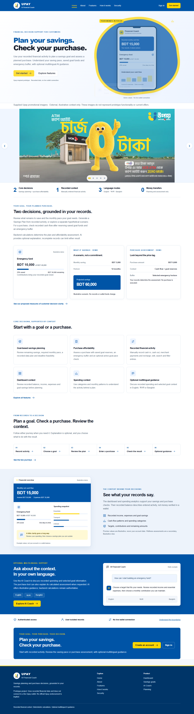
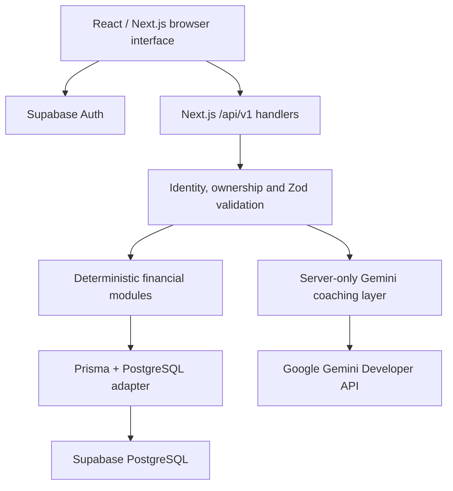
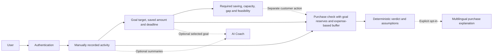
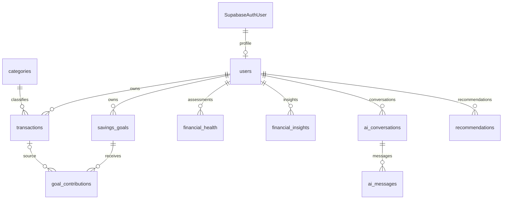
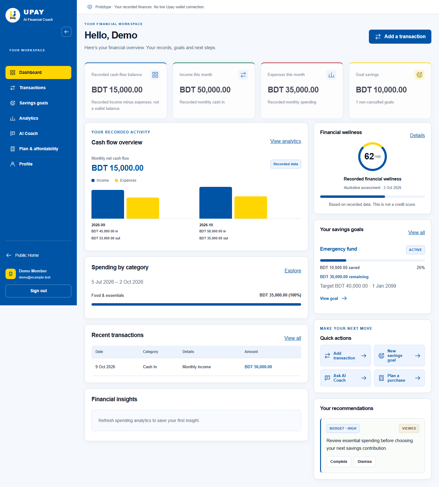
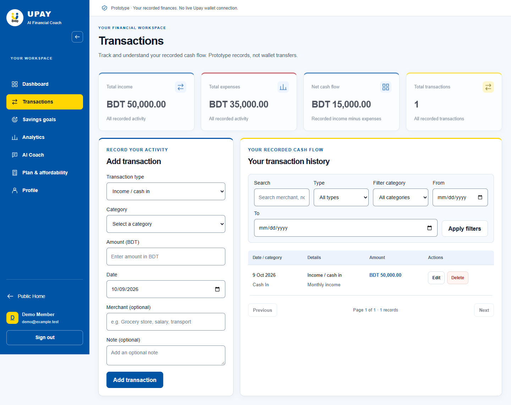
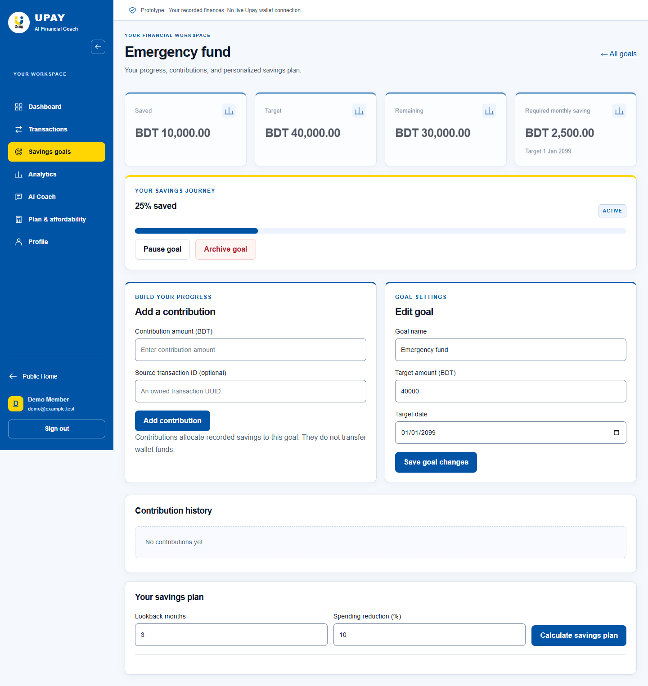
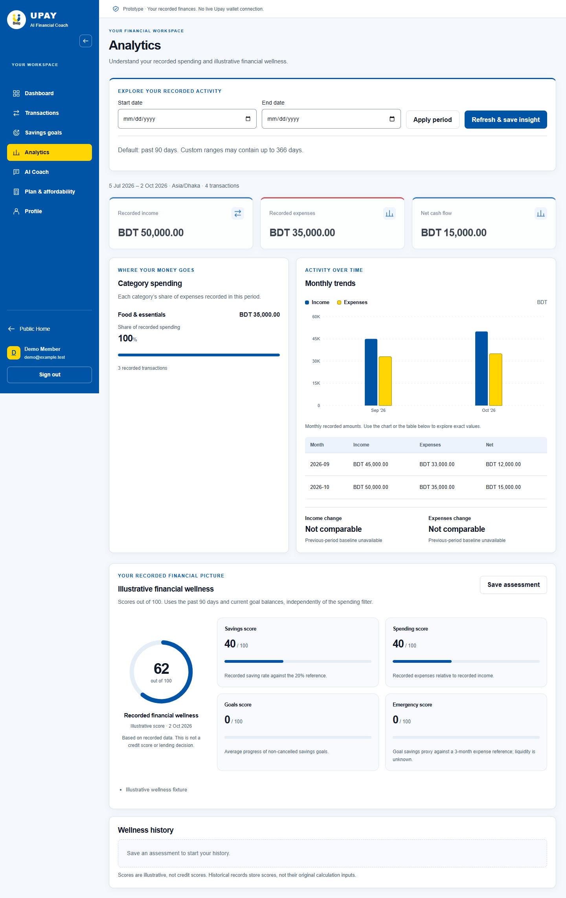
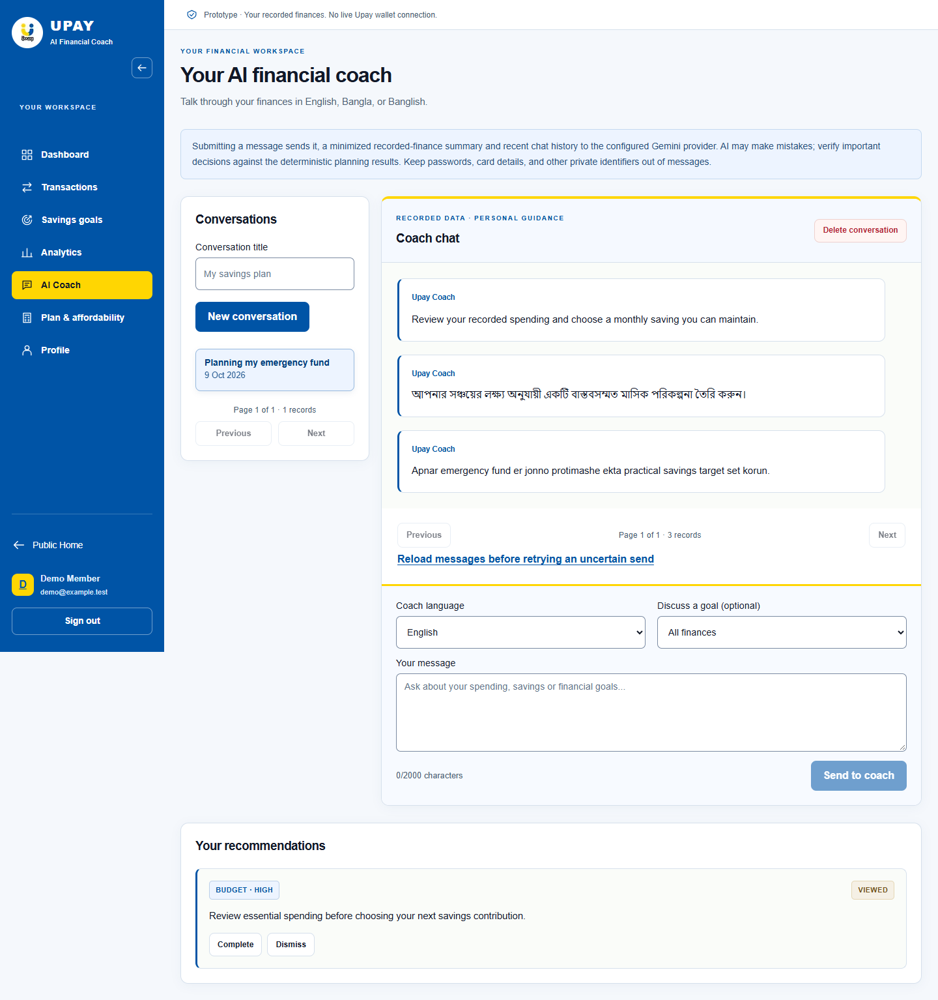
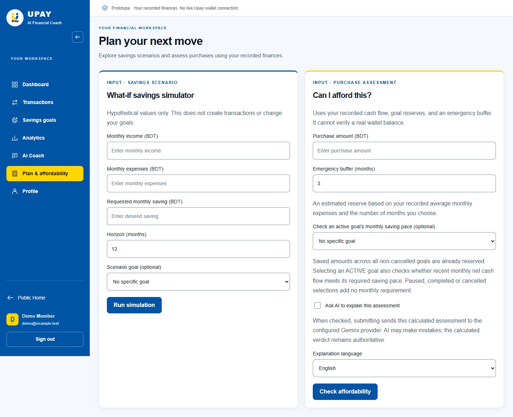

# Upay AI Financial Coach

**Final Project Report**

AI-Powered Personal Financial Management and Decision-Support Prototype

Live Application: https://upay-ai-hackathon.vercel.app/

Team Name: HackStreet Boys Team

Institution: Daffodil International University

Hackathon/Event: AI Hackathon/Upay AI Dev Fest 2026

Submission Date: 4 October 2026 (2026-10-04)

Report revision: 10 October 2026

The original report documents repository context from 3 October 2026; customer-impact and offline AI evidence were extended on 7 October, and Stage 6 reliability evidence was refreshed on 8 October 2026. It describes a prototype based on user-recorded financial data, without a live Upay wallet connection or official Upay endorsement.

<!-- PAGE BREAK -->

# Table of Contents

1. [Cover](#upay-ai-financial-coach)
2. [Executive Summary](#2-executive-summary)
3. [Introduction & Problem Statement](#3-introduction--problem-statement)
4. [Objectives, Scope & Requirements](#4-objectives-scope--requirements)
5. [System Architecture & Workflow](#5-system-architecture--workflow)
6. [Database Design](#6-database-design)
7. [Technology Stack](#7-technology-stack)
8. [Core Features & Implementation](#8-core-features--implementation)
9. [AI & Financial Intelligence](#9-ai--financial-intelligence)
10. [Important Financial Calculations](#10-important-financial-calculations)
11. [Security, Privacy & Responsible AI](#11-security-privacy--responsible-ai)
12. [Testing & Deployment](#12-testing--deployment)
13. [Results, Limitations & Future Scope](#13-results-limitations--future-scope)
14. [Conclusion](#14-conclusion)
15. [References](#15-references)

Report organization: the cover is Section 1; numbered technical sections run from 2 to 15. Core implementation is grouped into nine modules in Section 8. Three diagrams summarize architecture, workflow and database relationships. Seven project screenshots document the public introduction and core workspace screens.

Evidence policy: implementation claims are grounded in the current source, not promotional material. Section 12 separates fresh local, mocked-browser, offline and simulated results from historical evidence and checks not performed. The supplied production URL identifies the application; production configuration and authenticated production behavior were not independently audited.

Screenshot provenance: the seven images in [docs/screenshots](docs/screenshots) are unedited captures of this project's real local production build from the passed Playwright desktop run on 9 October 2026, at a 1440-pixel viewport. Workspace screens use synthetic Auth/API fixtures; chat replies are authored examples, not live Gemini output. Fixture values exercise presentation and need not represent a mutually consistent account or a backend-calculated assessment. These screenshots demonstrate UI rendering, not customer records, financial outcomes or authenticated production behavior. Original test captures remain preserved locally; only the seven selected report assets are included in the repository.

<!-- PAGE BREAK -->

# 2. Executive Summary

Personal financial records are often fragmented across income entries, spending notes and savings intentions. Recording transactions alone does not explain whether a savings target is realistic, how spending patterns affect progress, or what funds should be protected before a purchase. Users need a clear connection between their records and the decisions they make.

UPAY AI Financial Coach addresses this problem through an integrated personal financial management and decision-support prototype. Users can register, record income and expenses, manage savings goals and contributions, review a dashboard, analyze category spending and monthly trends, and explore savings or purchase scenarios. Financial wellness combines four illustrative components: savings, spending, goal progress and emergency coverage. Current assessments can be saved for historical comparison.

The project separates deterministic calculation from generative explanation. Backend modules calculate balances, goal progress, required monthly saving, wellness scores, spending-reduction plans, savings projections and affordability verdicts. Google Gemini receives minimized, precomputed financial context and limited conversation history to produce natural-language coaching and qualitative recommendations. English, Bangla and Banglish are supported, with structured response validation and a Latin-script check for Banglish. Optional AI affordability explanations describe an already calculated assessment.

The implementation uses Next.js App Router, React and TypeScript for the interface and API handlers; Supabase Auth for identity; PostgreSQL and Prisma for persistence; Zod for validation; and custom CSS and SVG for presentation. The repository points to GitHub version control and documents a Vercel deployment with Supabase services. Vitest and Playwright provide mocked and fixture-backed verification paths. Historical report preparation recorded 222 tests across 23 Vitest files, a passing typecheck and five lint warnings. Fresh Stage 6 results and their evidence boundaries are recorded in Section 12.

The resulting prototype demonstrates an end-to-end journey from recorded activity to understandable financial guidance. It does not synchronize an Upay wallet, verify liquid funds, execute payments, determine creditworthiness or replace professional advice. Its value is a transparent combination of financial calculations, goal tracking and multilingual explanation.

# 3. Introduction & Problem Statement

The project is motivated by a practical gap: people may know individual income and spending amounts but lack a consolidated view of cash flow, savings commitments and purchase capacity. A ledger can show what happened; financial intelligence also helps explain patterns and compare possible next steps.

The proposed solution brings records, goals, analytics, planning and coaching into one authenticated workspace. BDT presentation and Asia/Dhaka date handling support the local use context. AI is used to make supplied financial facts easier to understand and to offer qualitative budgeting suggestions; reproducible numerical decisions remain in application code.

Figure 1. Public landing page introducing the prototype and account entry points. The supplied promotional carousel is external imagery, not prototype functionality or a verified current offer.

<!-- PAGE BREAK -->

# 4. Objectives, Scope & Requirements

The primary customer objectives are savings plan clarity and purchase decision clarity: expose the required saving pace, scenario gap and feasibility, then assess a planned purchase with recorded cash flow, saved-goal reserves and an estimated emergency buffer. Multilingual AI guidance provides optional supporting explanation. Whether these outputs improve customer understanding or behavior remains to be validated.

Supporting objectives are to maintain an owned financial record, calculate transparent summaries, support goal contributions and deadlines, compare saving and purchase scenarios, and retain coaching conversations and recommendations. The intended persona is Customer only, in an MFS-oriented recorded-data context. Account access does not verify Upay-customer status or link a live wallet; evaluators review the prototype rather than form a separate product persona.

Table 1. Compact requirements and implementation scope.

| Requirement | Implemented scope |
| --- | --- |
| Account access | Email/password signup/login, conditional confirmation callback, restored sessions and local sign-out. |
| Financial records | Category-based income/expense CRUD, search, type/category/date filters and pagination. |
| Savings management | Goals, contributions, progress, monthly requirements and eligible lifecycle changes. |
| Financial intelligence | Dashboard, spending analytics, current/saved wellness and deterministic planning. |
| AI support | Multilingual coaching, optional goal context, validated recommendations and optional affordability explanation. |
| Data isolation | Verified identity, application-profile requirement and user-scoped API queries. |
| Usability and robustness | Responsive layouts, accessible controls, reduced-motion handling, validation and safe error states. |

Scope includes public introduction pages and the protected dashboard, transactions, goals, analytics, coach, planning and profile routes. The frontend consumes Next.js APIs under /api/v1; no separate backend application is required.

Non-functional priorities are maintainable typed interfaces, Decimal-based money arithmetic, authenticated ownership checks, bounded request and response shapes, atomic related writes, responsive navigation and server-side secret handling. These are implemented controls rather than certifications or measured service-level guarantees.

The prototype relies on recorded transactions and current goal balances. It has no automated wallet synchronization, payment execution, lending decision engine or professional-advice service. AI availability depends on provider configuration, quota and response validity. Password recovery and social OAuth interfaces are not implemented. Supabase controls email confirmation and password policy.

Source anchors: app/(workspace)/; components/auth-provider.tsx; lib/auth.ts; lib/validation.ts; lib/analytics-validation.ts; lib/phase56-validation.ts.

<!-- PAGE BREAK -->

# 5. System Architecture & Workflow

Next.js hosts React pages and Node.js API route handlers in one repository. The browser uses Supabase Auth for sessions and sends a Bearer access token through the typed API client. Server handlers independently verify identity and application-profile availability before accessing user-owned data. The confirmation callback can exchange an authorization code using SSR cookies.

Figure 2. High-level architecture: financial calculations and optional AI generation remain separate server-side responsibilities.

Prisma connects to PostgreSQL using a server-side connection string. Calculation modules prepare analytics and planning results. Gemini receives selected metrics only when coaching or an AI explanation is explicitly requested. Provider calls for coach turns occur outside database transactions; validated messages and recommendations are then committed atomically.

Figure 3. The two customer decision journeys share recorded context. Purchase explanation and separate summary-based coaching are optional; the tools remain independently accessible after sign-in.

The user records activity, reviews results, tracks contributions, explores scenarios and deliberately submits a coaching request. Recommendations can be marked read, completed or dismissed. This journey does not initiate a transfer or purchase. Vercel is the documented Next.js host; Supabase provides authentication and PostgreSQL services.

Source anchors: app/layout.tsx; components/auth-provider.tsx; lib/frontend/api-client.ts; lib/auth.ts; lib/prisma.ts; lib/coach-context.ts; DEPLOYMENT.md.

<!-- PAGE BREAK -->

# 6. Database Design

The Prisma schema defines ten application entities in public and a minimal externally managed auth.users reference. Monetary fields use Decimal(18,2); wellness scores use Decimal(5,2). UUID identifiers and user/date/status indexes support ownership and ordered retrieval.

Figure 4. Compact ER view of declared relationships; SupabaseAuthUser maps to externally managed auth.users.

Table 2. Major entities and representative source-defined fields.

| Entity | Purpose and important fields |
| --- | --- |
| users | Profile: user_id, full_name, email, phone, preferred_language. |
| categories | Shared classification: category_id, category_name, category_type, is_active. |
| transactions | user_id, category_id, transaction_type, amount, merchant_name, description, transaction_date, source. |
| savings_goals | user_id, goal_name, target_amount, current_amount, target_date, status. |
| goal_contributions | goal_id, optional transaction_id, amount, contribution_date. |
| financial_health | user_id, overall/four component scores, assessment_date. |
| financial_insights | user_id, insight_type, title, description, JSON metadata. |
| ai_conversations | user_id, conversation_title, created_at, updated_at. |
| ai_messages | conversation_id, role, message_content, created_at. |
| recommendations | user_id, recommendation_type, recommendation_text, priority, status. |

Most records own a user_id directly; contributions and messages inherit ownership through a goal or conversation. Categories are shared. Deleting a source transaction sets contribution.transaction_id to null, preserving history. Conversation deletion cascades to messages. Recommendations reference the user, not a conversation or message foreign key.

Supplied SQL enables RLS with owner-read policies and active-category reads; privileged Prisma access still depends on API ownership checks. Actual remote policy deployment was not audited. Source: prisma/schema.prisma and prisma/row-level-security.sql.

<!-- PAGE BREAK -->

# 7. Technology Stack

Table 3. Technologies actually declared or implemented in the repository.

| Technology | Purpose in Project |
| --- | --- |
| Next.js 16.3.8 | App Router pages/layouts, Node.js HTTP handlers and metadata. |
| React / React DOM ^19.2.0 | Interactive forms, session-aware navigation and financial presentation. |
| TypeScript ^5.9.3 | Typed frontend, routes, schemas and calculation modules. |
| Custom CSS / inline SVG | Blue/yellow styling, responsive layouts, charts and lightweight motion. |
| PostgreSQL / Supabase | Relational financial storage and hosted database services; server version is not asserted. |
| Prisma 7.10.0 / PrismaPg | ORM, PostgreSQL adapter and Decimal financial arithmetic. |
| Supabase JS 2.117.2 / SSR 0.12.7 | Identity, browser sessions and callback cookie exchange. |
| Google GenAI SDK ^2.26.0 | Server-only Gemini Developer API requests. |
| Zod 4.6.5 | Strict request and AI response validation. |
| Vitest ^4.1.11 | Unit, component and mocked route/integration regressions. |
| Playwright ^1.63.0 | Fixture-backed Chrome desktop/mobile-emulated browser tests. |
| ESLint ^9.39.5 | Static checks with Next.js and TypeScript rules. |
| npm, Git / GitHub, Vercel | Dependency/build scripts, version control and documented Next.js hosting. |

Versions are package.json declarations, including range prefixes; they are not claims about every production runtime. The UI uses local components, native progress elements and custom visualizations, with Recharts 3.10.1 for selected Analytics visualizations. The build command is prisma generate followed by next build.

# 8. Core Features & Implementation

## 8.1 Authentication

Signup and login use Supabase email/password authentication. Signup includes profile metadata and a fixed local confirmation callback; when confirmation is required, the interface reports that state. Login synchronizes the application profile. Logout uses Supabase local-session sign-out.

AuthProvider restores and refreshes sessions, tracks the application profile and supplies authenticated API requests. AppShell waits during restoration, redirects signed-out users to /login and presents profile-sync recovery where needed. Financial APIs independently validate identity with auth.getUser() and normally require an application profile; frontend redirects alone do not authorize data access.

Public pages provide auth-aware account actions. Password visibility controls preserve the entered value. Session restoration uses the shared accessible loading indicator. Source: components/auth-form.tsx, components/auth-provider.tsx, components/app-shell.tsx, app/auth/callback/route.ts and lib/auth.ts.

<!-- PAGE BREAK -->

## 8.2 Dashboard

The dashboard shows recorded cash-flow balance, current-calendar-month income and expenses, monthly net cash flow and savings across non-cancelled goals. Month boundaries use Asia/Dhaka. Its summary also retrieves up to five recent transactions, five stored insights and twenty active/paused goals ordered by deadline.

Separate spending and financial-health requests populate cash-flow trends, category spending and the wellness overview. Recommendations and quick actions connect the summary to transactions, goals, coaching and planning. Displayed recorded balance is not a verified wallet balance.

Figure 5. Dashboard combining recorded activity, goal savings, trends and wellness.

## 8.3 Transactions

Users record CASH_IN, CASH_OUT, MERCHANT_PAY or MOBILE_RECHARGE activity with a compatible income/expense category, amount and date; merchant and note are optional. The current page supports search, transaction-type/category/date filters and pagination. Editing and deleting are restricted to eligible manual/mock records.

Financial aggregation uses category_type to identify income and expenses. Transaction summary cards use dashboard totals, while the history count reflects the selected filters. Deleting a transaction preserves goal contribution history through the nullable source reference. There is no actual transfer, wallet debit or merchant payment execution.

Figure 6. Transaction entry, history filters and edit/delete controls with synthetic records.

## 8.4 Savings Goals

Goal creation records name, target, starting savings and target date. Detail views expose saved, remaining, progress and required monthly saving, plus contribution history. Contributions require an active goal, cannot exceed its remaining amount, and may reference an owned transaction whose total allocated amount is checked. Contribution insertion and balance/status changes are atomic; reaching the target completes the goal.

Active/paused goals can be edited, paused or resumed. Archive sets CANCELLED rather than deleting history; completed goals cannot be archived. Once contribution history exists, the API prevents direct replacement of current savings. An active goal can request a deterministic spending-reduction savings plan with category budgets and deadline feasibility.

Figure 7. Goal progress, required monthly saving, contribution controls and the empty contribution-history state in the synthetic fixture.

Source anchors: dashboard/summary, transactions and goals API handlers; lib/finance.ts; lib/savings-plan.ts; corresponding workspace pages.

<!-- PAGE BREAK -->

## 8.5 Analytics & Financial Wellness

Spending analytics calculates income, expenses, net cash flow, category amounts/shares, monthly trends and comparison with the preceding equal-length period. The default range is 90 days; validated custom ranges can contain 1–366 inclusive days. Monthly buckets follow Asia/Dhaka dates. Refresh & save insight persists a spending summary in financial_insights.

Wellness is calculated separately, by default from three 30-day averaging months and current non-cancelled goal balances. Savings, spending, goals and emergency scores each contribute 25% to the overall illustrative score. The interface displays all four components and permits saving an assessment. Paginated history reads stored scores and assessment dates; original inputs and formula versions are not stored in the health table. Changing the spending chart period does not automatically change the wellness request.

Figure 8. Spending trends and the four-component illustrative wellness assessment.

## 8.6 AI Financial Coach

Users create/delete owned conversations, review paginated chronological messages and select English, Bangla or Banglish with optional goal context. Creating a conversation does not call Gemini. An intentional message submission prepares 90-day financial metrics, up to five category summaries and selected-goal figures, alongside at most six recent user/assistant messages truncated to 2,000 characters each.

The server requests structured JSON containing a message and zero to three typed, prioritized recommendations. JSON parsing, strict Zod validation and Banglish script validation run before persistence. Messages, recommendations and the guarded conversation update are committed together. Provider generation happens outside this transaction, so a failed generation does not leave an orphan turn.

The UI supplies a UUID requestId. A retry of an already committed request can replay its stored result; conflicting reuse is rejected. Conversation timestamp guards reject stale concurrent persistence. These controls protect state but do not guarantee that concurrent requests consume provider quota only once.

Recommendations display LOW/MEDIUM/HIGH priority and NEW/VIEWED/COMPLETED/DISMISSED status. NEW can transition to any later state; VIEWED can complete or dismiss; terminal states cannot change. Repeating the same status is a no-op. Sanitized errors distinguish configuration, provider, timeout and validation failures without exposing raw prompts or keys.

Figure 9. Conversation view, language selection and recommendation actions with authored English, Bangla and Banglish fixture messages; no live Gemini response is shown.

Source anchors: lib/analytics.ts; lib/financial-health.ts; lib/coach-context.ts; lib/gemini.ts; coach message handlers; lib/recommendation-status.ts.

<!-- PAGE BREAK -->

## 8.7 What-if Savings Simulator

The simulator accepts hypothetical monthly income, monthly expenses, requested monthly saving, a 1–120 month horizon and an optional owned goal. It caps projected monthly saving at non-negative net cash flow and returns total projected savings, deficit information, remaining goal amount and an estimated goal timeline/date where possible.

This module uses submitted scenario inputs rather than automatically substituting transaction history. No transaction or contribution is created. Projection assumptions exclude interest, fees, inflation and other goals. A zero saving capacity cannot produce a completion date for an unfinished goal; dates exceeding the supported projection range return no date.

## 8.8 Purchase Affordability

The assessment accepts purchase amount, 0–12 emergency-buffer months, optional goal selection, optional explanation and language. It calculates recent monthly income/expenses from a fixed rolling 90-day period, while recorded cash-flow balance aggregates income minus expenses through the end of today. It reserves the current savings of all non-cancelled goals, not only the selected goal.

The emergency buffer multiplies average monthly expenses by the chosen months. Available-for-purchase subtracts goal reserves and this buffer from recorded balance, floored at zero. Balance-after-purchase subtracts only the purchase price from recorded balance. The deterministic verdict also checks recent income and, for an active selected goal, its required monthly saving.

AFFORDABLE, CAUTION, NOT_AFFORDABLE and INSUFFICIENT_DATA are backend decisions. Optional Gemini explanation describes the already computed result; it does not change the verdict. Calculation-only assessment does not call Gemini. Neither mode executes a purchase or changes savings.

Figure 10. Hypothetical savings and recorded-data purchase-assessment input forms. No calculated result or AI explanation is shown in this capture.

## 8.9 Profile & Navigation

Profile editing supports full name, optional phone and preferred coaching language; email is read-only and derived from Supabase identity. The coach additionally offers explicit Banglish selection. The workspace sidebar links to dashboard, transactions, goals, analytics, coach, planning and profile, with Public Home and logout always available.

Desktop collapse uses local component state, reducing width from 252px to 84px while retaining icons, accessible names, active indication, profile access and sign-out. It applies above 900px; mobile keeps the existing menu disclosure. Width transition and the shared loading spinner are enabled only when reduced motion is not requested. A custom 404 provides home/dashboard recovery links, and favicon metadata references the existing public/upay-logo.png asset.

Source anchors: lib/projections.ts; affordability/check and simulator/what-if handlers; profile/page.tsx; components/app-shell.tsx; app/not-found.tsx; app/layout.tsx.

<!-- PAGE BREAK -->

# 9. AI & Financial Intelligence

Deterministic logic controls transaction totals, goal progress and requirements, analytics, wellness, savings plans, simulation and affordability. These computations use local backend modules and Prisma Decimal arithmetic. Their results are available without model-generated arithmetic.

AI provides natural-language coaching, personalized qualitative explanations, multilingual guidance and recommendations. The affordability explanation receives the complete precomputed assessment. The system instruction tells Gemini to use supplied backend metrics, avoid inventing balances or recalculating figures, and direct absent numerical requests to calculation modules. The model has no database or tool access in this integration. Prompt rules reduce risk but do not guarantee numerical fidelity in generated prose.

Source configuration uses the Google Gemini Developer API via @google/genai, default model gemini-3.5-flash-lite and optional GEMINI_MODEL override. The endpoint is pinned to generativelanguage.googleapis.com, API version v1beta, with Vertex AI disabled. Temperature is 0.3 and maximum output tokens are 2,500. The HTTP timeout is 30 seconds; the overall abort deadline is 45 seconds. Up to two SDK attempts cover selected transient HTTP failures; 429 quota failures are not retried. No automatic fallback model is implemented. This is repository configuration, not a claim about the deployed environment's selected model.

Structured output is followed by strict parsing and validation. Bengali-block characters in Banglish message or recommendation text cause rejection without automatic regeneration. Diagnostic logging records sanitized stages/status rather than full prompts, financial records or credentials.

## 9.1 Actual AI responsibility and pipeline

Recorded transactions and goal records feed deterministic backend calculations. For chat, lib/coach-context.ts prepares a 90-day structured summary: income/expense/net averages, positive saving capacity, counts, goal totals, up to five spending categories, and optional selected-goal remaining amount, monthly requirement, status/deadline. Account IDs, contact fields, merchants and transaction descriptions are omitted. The route adds up to six recent messages capped at 2,000 characters each; user text can still disclose private data.

lib/gemini.ts serializes backendMetrics, recentConversation and userMessage as one user-content JSON payload, with a separate system instruction. That instruction treats user/history/category text as untrusted, prohibits arithmetic/invented financial facts, requests qualitative recommendations and routes missing numerical requests to calculation tools. The model has no database or tool access.

The SDK response is parsed as JSON, checked against the strict coachResponse schema, and passed through assertCoachLanguage. The schema requires a nonempty bounded message and zero to three recommendations with SAVING/BUDGET/GOAL/EMERGENCY types, LOW/MEDIUM/HIGH priorities and bounded nonempty text. Accepted chat turns and recommendations are stored atomically. For optional purchase explanation, the route sends the full precomputed assessment and returns only answer.message without chat/recommendation persistence. The prompt requests no recommendations in this branch; the common schema does not enforce that purpose-specific rule.

Financial responsibility stays in deterministic savings, affordability/verdict, analytics, wellness and simulator code. Generative responsibility is explanatory prose, coaching, qualitative recommendations and requested language presentation. General chat has no calculated purchase assessment or complete Savings Plan gap, feasibility or timeline. It cannot be presented as the affordability engine or an integrated full-plan explainer. Default model/configuration above describe source settings, not fresh provider availability or the deployed override.

## 9.2 Reproducible offline AI evaluation

Run `npm.cmd test -- tests/ai-evaluation.test.ts`. tests/fixtures/ai-evaluation.ts contains nine fixed synthetic cases: positive cash flow, a goal monthly saving shortfall, AFFORDABLE, CAUTION, NOT_AFFORDABLE, INSUFFICIENT_DATA, zero/limited expenses, overdue goal and fully funded goal. Financial facts are supplied snapshots; the suite does not retest or replace financial formulas.

tests/ai-evaluation.test.ts exercises the real Gemini SDK request builder and production parsing/validators using injected synthetic replies and credentials. Global fetch is blocked and asserted unused. The candidates are authored examples, not live or cached Gemini generations. Checks cover exact fact serialization, schema limits, three same-fact language conditions, invalid/empty output, script leakage, injection separation and explicit semantic counterexamples. Existing route tests separately cover a fixed backend purchase verdict and no explanation persistence.

**Evidence boundary:** an offline pass demonstrates application request/validation behavior with the supplied fixtures. It does not measure Gemini factual accuracy, recommendation usefulness, language fluency, live availability, latency/cost, customer benefit or prompt-injection resistance. No production prompt/provider/validator, public API, financial rule or database behavior is changed. No automated semantic detector is installed.

## 9.3 Factual, language and recommendation review

The following is a **proposed human evaluation rubric**, not scored results. Future review should use authorized model outputs paired with their exact fact snapshot, case ID, language, model/configuration, prompt revision and generation date. Fluent reviewers should record meets / needs revision / fails per dimension, retain supporting excerpts, and resolve disagreements. Report actual sample sizes and denominators only after review.

| Dimension | Review criterion |
| --- | --- |
| Numerical/factual consistency | Every stated amount, goal remaining value, required monthly saving, available purchase amount, verdict, status and date agrees with supplied facts. Missing figures are identified rather than calculated or invented. |
| Financial distinctions | Recorded balance differs from available purchase funds; hypothetical after-purchase cash flow does not deduct reserves. Goal savings do not prove liquid emergency cash. Zero recorded expenses do not prove complete history. |
| Unsupported claims | No live wallet access, verified funds, guaranteed safety/returns, invented forecasts or financial-independence claims. Overdue/funded/data-insufficient states retain their limitations. |
| Language quality | English in en; Bengali-script Bangla in bn; natural transliterated Bangla in banglish. Review fluency and comprehension, including recommendation text, rather than only script presence. |
| Recommendation usefulness | Relevance to the supplied context; a practical action; agreement with facts; no unsupported claims/numerical targets; a clear connection to the savings/purchase decision; appropriate category and priority. |

The current language validator imposes no automatic detector for English/Bangla. Banglish rejects Bengali-block U+0980–U+09FF characters in message and every recommendation, but permits other scripts and does not prove natural Banglish. The offline suite explicitly documents these limitations. Structured recommendation validity likewise does not establish usefulness; no human recommendation evaluation has been performed.

Seven deliberately unsafe prose fixtures contradict verdicts, goal remaining/required saving or available amounts, conflate balance with available funds, invent live wallet access, verify emergency liquidity without evidence, or promise a completion date. Another gives an invented numerical target inside an otherwise valid recommendation. They are intentionally accepted by the current schema in offline tests, demonstrating the unresolved semantic risk. They must fail the human rubric; they are not examples of approved guidance. Robust multilingual semantic checking requires further evaluation rather than a brittle production regex.

Injection cases attempt to override a verdict, reveal hidden instructions/credentials, invent a balance, claim live Upay access and ignore context through a category label. Tests verify that the separate system instruction is unchanged, the malicious strings remain untrusted JSON data and the supplied deterministic facts are preserved. They do not demonstrate that Gemini obeys the instruction. Prompt text can still mislead the generated prose, even while the API's financial verdict remains independently calculated. Complete prompt-injection immunity is not claimed.

## 9.4 Calculation-only versus AI-assisted protocol

| Proposed condition | Presentation |
| --- | --- |
| Calculation-only baseline | Existing deterministic purchase figures, verdict, assumptions and limitation notes. |
| AI-assisted | The identical frozen purchase snapshot plus optional Gemini explanation in English, Bangla or Banglish. The verdict and numbers cannot differ between conditions. |

A future consented study would use equivalent tasks and randomize/counterbalance condition order to account for practice effects. Use the same fact/answer key for each case in both conditions and record explanation provenance. Measure correct interpretation rate, elapsed time to correct understanding, interpretation errors, anchored usefulness ratings and confidence/comprehension separately. Capture language preference and reasons; preference or increased confidence does not establish factual accuracy. Keep failed tasks in reporting. Compare authorized generated explanations only when separately permitted; the current authored offline fixtures are not Gemini-quality samples.

Savings-plan comprehension remains the other primary customer outcome. Its complete result is not currently passed to Gemini, so this controlled same-result AI comparison uses the existing purchase-explanation path. General Coach can discuss selected-goal facts and produce recommendations as a separate supporting task. No user-study or before/after AI benefit results exist.

## 9.5 Predictive ML status and future requirements

**Predictive ML is not part of the current validated prototype.** Inspection found no predictive training pipeline, trained predictive artifact or suitable labeled historical dataset. Deterministic projections, wellness, savings and affordability are not ML; no fake model, synthetic-label benchmark, training result or MAE/RMSE/classification score is presented.

Future predictive work must first define a useful target and obtain an appropriate consented/anonymized historical dataset. Separate train/validation/test data with an unseen holdout, respecting time order and customer grouping; choose simple baselines; check feature/label and temporal leakage; and assess privacy, representation and fairness. Evaluate forecasting with held-out MAE/RMSE and suitable uncertainty analysis, or risk prediction with classification and calibration metrics against an appropriate baseline. A small synthetic fixture set cannot establish predictive performance. This future work does not alter the current two-outcome prototype.

# 10. Important Financial Calculations

The following formulas are verified against lib/finance.ts, lib/analytics.ts, lib/financial-health.ts, lib/savings-plan.ts and lib/projections.ts. BDT values are normally returned to two decimal places. A 30-day averaging month used by analytics differs from the deadline month approximation used for goal requirements.

## 10.1 Recorded Cash Flow and Goal Calculations

Recorded cash flow = sum(income-category amounts) − sum(expense-category amounts). Dashboard balance uses all recorded transactions; affordability balance includes records through today. Neither is a verified available account balance.

Goal progress = min(current_amount / target_amount × 100, 100), rounded to two decimals. Remaining amount = max(target_amount − current_amount, 0).

For required monthly saving, days = max(target_date − reference_date, 0), measured in days; months = max(1, ceil(days / (365.25 / 12))). Required monthly saving = remaining / months, rounded upward to cents. An unfinished goal with days = 0 is overdue; the denominator remains at least one month.

Source anchors: lib/finance.ts: goalData(); dashboard/summary handler; lib/analytics.ts: totals(); lib/projections.ts: affordability().

<!-- PAGE BREAK -->

## 10.2 Wellness and Emergency Coverage

Let M = periodDays / 30, I = period income / M, E = period expenses / M, and S = sum(current_amount) across non-cancelled goals. Define score(x) as clamp(x, 0, 100), rounded to two decimals.

Savings score = score(((I − E) / I) / 0.20 × 100), when I > 0; otherwise 0. Spending score = score((2 − E / I) × 50), when I > 0; otherwise 0.

Goal score is the arithmetic mean of the individually clamped/rounded progress percentages of non-cancelled goals, then clamped/rounded again. A non-positive target contributes zero; no included goals yields zero.

Emergency coverage months = S / E when E > 0; otherwise unknown. Emergency score = score((coverageMonths / 3) × 100); unknown coverage yields zero. All non-cancelled goal savings are a proxy, with no requirement for an emergency-fund goal name or liquid balance. Overall wellness = score((Savings + Spending + Goals + Emergency) / 4).

## 10.3 Savings Plan and Simulation

Savings-plan category averages use period amounts / M, rounded to cents. Each reduction is floor-to-cents(average × reductionPercent / 100). Projected monthly saving = max(monthly surplus + sum(category reductions), 0). Deadline feasibility requires a non-overdue goal, positive projected saving and remaining amount ≤ projected saving × remaining days / 30. Defaults are three lookback months and 10% reduction; validated reduction ranges from 0–50%.

Simulator capacity = max(input monthly income − input monthly expenses, 0). Projected monthly saving = min(requested monthly saving, capacity). Projected savings = projected monthly saving × horizonMonths. For an unfinished selected goal with positive projected saving, months to goal = ceil(remaining / projected monthly saving). Completed goals need zero months; unfinished goals with no capacity have no calculable timeline.

## 10.4 Emergency Buffer and Purchase Verdict

Affordability uses 90 days, so average monthly expenses = periodExpenses / 3. Emergency buffer = average monthly expenses × emergencyBufferMonths. Available for purchase = max(recordedCashFlowBalance − all non-cancelled goal savings − emergencyBuffer, 0). Balance after purchase = recordedCashFlowBalance − purchaseAmount.

Example supplied by the project owner: assuming BDT 5,000 expenses are within the 90-day period, monthly expenses = 5,000 / 3; a three-month buffer = (5,000 / 3) × 3 = BDT 5,000. With recorded income BDT 125,000 and reserved savings BDT 15,000, recorded balance is BDT 120,000 and available for purchase is BDT 100,000. Balance after purchase remains BDT 120,000 minus the chosen price. These are illustrative supplied inputs, not independently retrieved production records.

Enough data requires a positive all-time transaction count and positive recent income. AFFORDABLE requires enough data, price ≤ available and monthly net cash flow ≥ the active selected goal's monthly requirement (zero otherwise). Without enough data: INSUFFICIENT_DATA. Otherwise, if price ≤ max(recorded balance, 0): CAUTION; if not: NOT_AFFORDABLE.

<!-- PAGE BREAK -->

# 11. Security, Privacy & Responsible AI

Authentication is checked independently by APIs using Supabase identity verification. Financial routes normally require an application profile. Queries derive user ownership from verified identity, not a client-provided user ID; child resources also verify their owned parent. Multi-record goal and coach writes use database transactions, and contribution validation protects balances and source allocations.

DATABASE_URL and Gemini credentials remain server-side. The root layout intentionally supplies validated public Supabase URL and publishable/anon configuration for browser authentication. A service-role key is not required. Environment examples contain placeholders; .env and environment files are ignored except .env.example.

Zod validates UUIDs, dates, amounts, bounded text, enum transitions and strict payloads. The common API layer supplies safe error envelopes and no-store responses. AI/user text is rendered through React rather than injected as raw HTML. Fixed callback destinations reduce unsafe redirect handling.

Coaching sends the submitted message, bounded conversation history and minimized metrics to Google. The context excludes transaction descriptions, merchant names and complete histories; category labels and selected-goal figures remain. Instructions treat user content as untrusted and prohibit requests for credentials. Users can still submit sensitive text, and prompting cannot eliminate privacy or prompt-injection risk.

The prototype has no live wallet access, payment tools or purchase execution. Wellness is not a credit score, and coaching is informational rather than professional advice. Supplied RLS policies are additional controls; application-level isolation is essential for privileged Prisma access. Retention, operational access and monitoring require further production review.

# 12. Testing & Deployment

The subsequent Analytics Recharts redesign and final tooltip/documentation fixes passed 358/358 Vitest tests and 64/64 mocked browser cases on 9 October 2026. The [latest local verification summary](README.md#testing--quality-assurance) records the remaining checks and evidence boundaries; the stage-specific results below are preserved historical evidence.

**Fresh Stage 9 documentation verification, 8 October 2026:** typecheck PASS; ESLint 0 errors/5 existing warnings; 326/326 Vitest tests in 29 files PASS (0 failed/skipped); Node-native local import/secret-pattern audit PASS; 45 local documentation links/anchors valid; `git diff --check` PASS. Checks exited 0. Application/test code and Stage 7/8 reviews were preserved; only this report, README and the new [Stage 9 review](STAGE9_INNOVATION_DIFFERENTIATION.md) were changed/added. Build/browser were not rerun for documentation changes; Stage 8 results below remain historical. These checks do not measure competitive advantage, AI usefulness or customer impact.

Stage 8 Responsible AI/security review is recorded in [STAGE8_RESPONSIBLE_AI_SECURITY.md](STAGE8_RESPONSIBLE_AI_SECURITY.md) with exact provider context, threats, privacy/consent, deletion inventory and separate fresh checks. The README control matrix distinguishes tested implementation from production verification. Financial formulas and the emergency-savings proxy remain unchanged; factual prose validation, account-wide deletion, automatic retention and deployed RLS verification remain unresolved.

**Fresh Stage 8 resume verification, 8 October 2026:** typecheck PASS; ESLint 0 errors/5 existing warnings; 326/326 Vitest tests in 29/29 files PASS; focused Responsible AI/security checks 123/123 in seven files PASS; production build PASS; complete mocked browser 60/60 PASS (desktop 30/30, mobile 30/30; no failed/skipped/flaky cases); Node-native local import/secret-pattern audit PASS (136 source files and 18 commits, no findings); `git diff --check` PASS. All commands exited 0. The known Windows teardown issue required stopping only this run's verified local Next server after all cases passed, allowing Playwright to report its final success/JSON. This resume changed only documentation, preserved existing Stage 6/7/8 source/tests and added no features. Mobile is Chromium/Chrome emulation, not physical-device Safari. These results do not prove deployed RLS, prompt-injection immunity, truthful AI prose or production security. Exact reproduction/evidence and remaining limits are in the Stage 8 report; Stage 6/7 evidence below remains historical.

Stage 7 scalability/integration review is recorded in [STAGE7_SCALABILITY_INTEGRATION.md](STAGE7_SCALABILITY_INTEGRATION.md), including architecture, API protection, DB/RLS/connection audit, future authorized MFS design and separate fresh verification. Stage 6 evidence below is preserved. The new limiter is process-local, not distributed; Upay integration remains design-only.

Table 4. Stage 6 verification matrix — local evidence collected on 8 October 2026.

| Evidence category | Observed status | What it establishes / limitation |
| --- | --- | --- |
| STATIC / LOCAL VERIFICATION | Typecheck PASS; ESLint 0 errors/5 existing warnings; 315/315 Vitest tests in 27/27 files PASS (0 failed/skipped); production build PASS. All commands exited 0. | Strict types, lint, complete Vitest regression suite and local production build; no load or live database benchmark. |
| MOCKED BROWSER VERIFICATION | Final complete run: 60/60 PASS in one file, desktop 30/30 and mobile 30/30; 0 failed/skipped; exit 0. Focused changed cases also 4/4 PASS. | Real built UI, intercepted Auth/application APIs, synthetic users and records; unmatched external browser traffic blocked. |
| OFFLINE AI EVALUATION | 41/41 synthetic evaluation tests PASS, included in the final Vitest suite. | Real SDK request construction with injected transport, authored replies, schemas, multilingual script checks and factual counterexamples; no live model-quality metric. |
| SIMULATED FAILURE / CONCURRENCY TESTS | 10/10 contribution tests PASS, included in the final Vitest suite; existing coach and recommendation tests retained. | Application-level conflict/concurrency handling under simulated conditions. Fixture snapshots, injected P2034, rollback and explicit retry; not real PostgreSQL/Supabase concurrency. |
| HISTORICAL / MANUAL EVIDENCE | Original report: 222 tests/23 files and 5 lint warnings. Supplied Stage 5 record: 301 tests/26 files, typecheck/build PASS, 5 lint warnings, 41 evaluation tests. | Historical counts retained as historical. No fresh authenticated production, startup/smoke or remote Auth/database verification was performed in this resume. |
| NOT VERIFIED | Production database concurrency; production load/performance, reliability and scalability; live wallet access/automatic ingestion; customer impact; live Gemini accuracy, Bangla/Banglish quality, production prompt-injection resistance and real provider availability. | Local/mocked/synthetic success does not establish these claims. |

**PRE-STAGE-6-RESUME BASELINE:** `npm.cmd run typecheck` PASS; `npm.cmd run lint` exit 0, 0 errors/6 warnings; `npm.cmd test` 309/309 tests in 27/27 files PASS; `npm.cmd run build` PASS; `npm.cmd run test:browser` exit 1, 58 PASS/2 FAIL out of 60. Both browser failures were the same stale About-page section count (7 expected, 8 rendered) in the two projects. Source inspection identified related stale ecosystem wording and `pause/resume` casing. These were test drift after intentional Stage 1–4 changes, not a demonstrated application regression. The sixth lint warning was an unused import in the untracked contribution/concurrency suite.

**Intermediate validation correction:** a later complete browser attempt returned 58 PASS/2 FAIL because this resumed session introduced an incorrect direct-adjacency assertion for introduction/carousel placement. Source review confirmed the existing promotional disclosure between them. The assertion was corrected to verify introduction → disclosure → carousel; the UI was unchanged. That attempt's log and error contexts were preserved under `coverage/stage6/stage6-intermediate-*` before the final complete rerun. A unique recommendation Serializable/no-op assertion was also preserved in the existing route suite during consolidation; typecheck/lint/full Vitest were rerun after that adjustment.

**Final reproduction commands:** `npm.cmd run typecheck`, `npm.cmd run lint`, `npm.cmd test -- --reporter=default --reporter=json --outputFile=coverage/stage6/stage6-final-vitest.json`, `npm.cmd run build`, `npm.cmd run test:browser`. The earlier focused commands were `npm.cmd test -- tests/concurrency.test.ts tests/frontend-client.test.ts tests/phase56-routes.test.ts tests/ai-evaluation.test.ts` (102 tests/4 files PASS), and `npm.cmd run test:browser -- --grep 'public pages have distinct|empty records'` (4/4 PASS). Node `v24.15.0`, npm `11.12.1` and installed Chrome were used. No database push/seed, live Gemini script, paid external API, deployment, commit or push was performed.

**Browser/user-flow evidence:** public navigation/history/CTAs; signup, login, confirmation UI, protected routes, session restoration and logout; dashboard; transaction history/creation/editing; goal creation/contribution/pause/resume/details and savings plans; analytics and illustrative wellness saving; simulator and affordability; multilingual synthetic coach messages/recommendation actions and conversation deletion; profile persistence; 404/callback; loading, HTTP failure/retry, error-boundary recovery and widths 320–1440. Generated screenshots cover public/auth pages and synthetic authenticated workspace screens under ignored `test-results/`. Captures are not production evidence, real-device Safari coverage or an automated visual-diff benchmark. Coverage is representative: transaction deletion/filter submission and goal archiving are not explicitly exercised as browser actions.

**Failure boundaries:** failed forms preserve input; calculator edits clear stale results; delayed transaction reads show loading before HTTP 500, then recover on explicit Retry; malformed dashboard data reaches a recoverable error boundary. Offline API-client tests reject malformed JSON envelopes without an automatic retry, then accept an explicit new request. Existing provider tests cover unavailable/time-limited/rate-limited/malformed output and Banglish leakage. Optional purchase explanation failure returns an error for that request; explicitly retrying with explanation disabled returns the same deterministic assessment. No automatic explanation fallback is claimed.

**Simulated conflict boundaries:** two real handler invocations reach a controlled fixture commit barrier using the same in-memory snapshot. A fixture-injected Prisma P2034 permits only one set of writes to be published, including when two goals share a source transaction; explicit retries revalidate the winning balance/allocation. Insert, goal-update and commit failures discard staged fixture writes and permit a later explicit retry. The fixture supplies rollback/serialization behavior; it does not test the database engine. Existing recommendation tests cover competing terminal actions and same-status no-ops; existing coach tests cover stale conversation guards, request-ID replay and mocked message/recommendation rollback. Contributions and general create endpoints have no request-ID deduplication or automatic transaction retry; refresh uncertain writes before retrying. Concurrent coach requests can still consume provider quota more than once.

**Local test-environment limitation:** on this Windows sandbox, Playwright server teardown stalled after completed cases. `Stop-Process -Id <the local Next PID printed by [WebServer]> -Force` released teardown and allowed the runner to report its actual pass/fail status. The test runner and unrelated processes were not terminated. This cleanup issue is test infrastructure evidence, not an application regression. Raw logs and initial worktree copies are retained locally in ignored `coverage/stage6/`; rerunning commands reproduces the suites, not production verification.

Vitest covers arithmetic, validation, auth/ownership, routes, API clients, output parsing, language rules, retry/persistence behavior and UI regressions. Gemini suites mock the SDK or inject synthetic HTTP transports. These tests do not prove live model quality, quota availability or production RLS deployment. No live AI verification script was run.

<!-- PAGE BREAK -->

## 12.1 Deployment Configuration

The Git remote identifies https://github.com/shehabRabby/UpayHackathon.git. The owner-provided live application is https://upay-ai-hackathon.vercel.app/. DEPLOYMENT.md documents Vercel hosting for the Next.js app and Supabase for Auth/PostgreSQL; this report does not claim that the current checkout and deployed commit are identical.

The documented release path uses Node.js 24 LTS, npm ci and npm run build. Node.js runtime handlers support Prisma/PostgreSQL; coach and AI affordability handlers declare a 60-second maximum duration. Supabase Site URL and allowed /auth/callback redirects require environment-specific configuration.

Required configuration names include DATABASE_URL, the public SUPBASE_URL and SUPBASE_PUBLISHABLE_KEY (SUPABASE_* alternatives are supported), and GEMINI_API_KEY for AI requests. DIRECT_URL is optional for administrative CLI access; GOOGLE_API_KEY is a fallback and GEMINI_MODEL an optional override. No secret values are included here.

There is no versioned Prisma migration history in the repository. Fresh database provisioning requires reviewing the schema, supplemental SQL constraints, RLS policies and category seed. An ordinary application build/deployment does not push/reset/seed the database. Neither deployment nor remote configuration was changed during documentation generation.

## 12.2 Stage 6 resume and multi-agent change audit

The resume started at `05d68ad` on `main`, matching the recorded `origin/main` reference. Initial status: one modified tracked file (`e2e/application.spec.ts`), two untracked files (`tests/concurrency.test.ts`, `install.cmd`) and no staged files. Status, full/summary/cached diffs, the latest 15 log/reflog entries, file history, scripts, tests/fixtures, relevant handlers and financial-write boundaries were reviewed before implementation. No production-code, formula, affordability-verdict, auth, schema, package/lockfile or test-configuration changes existed in the initial worktree.

| Initial file/area | What existed / origin evidence | Completeness and risk | Decision in this resume |
| --- | --- | --- | --- |
| Committed application, tests, fixtures and docs | Category A: existing committed project code. HEAD contains the offline AI fixtures/evaluation and documentation. Commit authors identify a Git identity, not whether Codex/Antigravity edited the files. | Existing coach retry/rollback/provider guards, recommendation transitions and representative browser workflows were useful and complete within mocked boundaries. Verification documentation needed fresh results. | KEEP; preserve Stage 1–5 behavior and all committed test coverage. |
| `e2e/application.spec.ts` | Public headings, core-decision copy, workflow labels and carousel order had been updated. These overlap the previous-Codex work described by the owner, but Git has no tool attribution. Category D: **Origin cannot be reliably determined from repository evidence.** | Useful partial stale-test alignment; no production/formula/auth change. About section count/ecosystem wording/casing remained stale. A count-only carousel check was weaker than a placement check. Low test-only regression risk. | KEEP existing alignment; ADJUST remaining stale assertions, verify introduction → promotional disclosure → carousel order, add controlled loading/recovery assertions and block unmatched external browser traffic. |
| `tests/concurrency.test.ts` | Eight offline mocked contribution/recommendation/coach tests, untracked. Category D: **Origin cannot be reliably determined from repository evidence.** | Partially useful: four contribution cases; four recommendation/coach cases overlapped committed suites. No real competing contribution invocations, injected database conflicts or rollback fixture. Unused import produced a sixth lint warning. No production/formula/verdict/auth change. | ADJUST to ten focused contribution cases: preserved capacity/status/transaction safeguards, added COMPLETED status, competing requests, shared-source conflict and insert/update/commit failure recovery. Consolidated four overlaps into committed coverage, retaining the original recommendation Serializable/no-op assertion in `tests/phase56-routes.test.ts`. |
| `install.cmd` | Untracked Antigravity CLI downloader/installer. Category C: possible Antigravity-related work based on explicit script content. **Origin cannot be reliably determined from repository evidence.** | Outside Stage 6; downloads/installs an executable if run. Not referenced by package scripts and no application/formula/auth effect while unused. Installer completeness was not exercised. | NEEDS REVIEW outside this task; preserved byte-for-byte and never executed. |

**Previous Codex attribution:** the owner's resume request is historical context for prior Codex activity. No changed file can be confidently attributed to an earlier editing tool using the available Git evidence. Uncommitted test changes could also include Antigravity activity; authorship is not guessed. This session's edits are explicitly identified above and in the final response.

**Preservation and conflicts:** useful existing work was reviewed before adjustment. The initial test files were copied into ignored local evidence storage, the installer was left unchanged, and all committed tests/AI fixtures were retained. The only duplicates identified were test cases already covered by committed coach/recommendation suites; no conflicting production edits or financial/auth regressions were discovered. No useful work was intentionally discarded without review. No destructive Git operation, commit, push, deployment or Stage 7 work was performed.

| Relevant judge concern | Stage 6 status | Evidence / remaining boundary |
| --- | --- | --- |
| Visible source/user-flow evidence | ADDRESSED | Source-linked test suites, reproducible local checks and generated synthetic workspace screenshots. |
| Stronger authenticated demonstration | PARTIALLY ADDRESSED | Signup/login/protected workflows, persistence and logout run against intercepted Auth/APIs; no real production account verification. |
| Browser/build/database/provider failures | PARTIALLY ADDRESSED | Local production build and browser failure/recovery checks plus offline DB/provider error paths; hosting/live-service failure behavior unverified. |
| Concurrent requests and recovery | PARTIALLY ADDRESSED | Competing mocked contribution/recommendation writes, injected P2034, rollback and coach replay; no production database/load test. |
| Live deployment reliability | NOT ADDRESSED | No deployment or live production verification was performed; the supplied URL alone is not evidence. |
| Production scale/performance | NOT ADDRESSED | No throughput, real load, multi-region or horizontal-scaling measurements. |

# 13. Results, Limitations & Future Scope

The prototype's two primary customer outcomes are savings plan clarity and purchase decision clarity. Stages 1–3 expose the saving pace, gap, feasibility and duration alongside a reserve-aware purchase assessment. Records, analytics and optional multilingual guidance support these decisions. The observed mocked test suite provides regression evidence for implementation behavior; it does not establish customer comprehension, behavioral improvement or business impact.

## 13.1 Customer impact and validation

**Customer-impact framing update: 7 October 2026.** This section distinguishes implemented product outputs, proposed customer success metrics and actual validated impact. Earlier technical verification entries remain historical; they are not customer-study results.

### Implemented measurable product outputs

| Primary customer outcome | Customer question | Outputs already calculated and displayed |
| --- | --- | --- |
| Savings plan clarity | Can I understand the saving pace required for my goal and whether the current recorded-data scenario appears feasible? | Remaining goal amount; required, available and projected monthly saving; remaining monthly gap; deadline feasibility; estimated months to goal; potential category spending adjustments. |
| Purchase decision clarity | Can I understand whether a planned purchase fits my recorded financial situation while accounting for goal savings and an emergency buffer? | Planned purchase; recorded cash-flow balance; saved-goal reserves; estimated buffer; available purchase amount; recent monthly net cash flow; selected ACTIVE-goal monthly requirement; deterministic affordability verdict. |

These figures are conditional recorded-data outputs. Goal savings are recorded allocations, not verified money held aside; the buffer is an expense-based estimate. A null completion duration is not estimable, and a zero monthly gap does not by itself establish deadline feasibility. A CAUTION verdict can arise from reserves/buffer or the monthly net-flow requirement even when the purchase fits the recorded balance. No financial rule is changed by this measurement framework.

### Proposed validation metrics — future customer study

Savings-task success checks: correctly identify required monthly saving and the remaining monthly gap; correctly interpret feasibility and the estimated duration (including a not-estimable state); explain at least one important assumption or limitation.

Purchase-task success checks: correctly identify available funds, goal reserves and the emergency buffer; correctly interpret the verdict; explain why CAUTION may occur; recognize when recorded data is insufficient. Correct interpretation includes distinguishing hypothetical recorded cash flow after purchase from spendable funds after reserves.

| Proposed measure | How a future study would measure it |
| --- | --- |
| Task completion rate | Completed all required interpretation checks without facilitator help, divided by task attempts; report sample size and incomplete attempts. |
| Interpretation accuracy | Correct answers divided by scored answers, using the displayed deterministic result and its limitations as the answer key. Report savings and purchase tasks separately. |
| Time to correct interpretation | Elapsed seconds from the task prompt to correct completion; report unsuccessful attempts separately. |
| Interpretation errors | Count incorrect amount readings, reserve/buffer confusion, verdict or feasibility misinterpretation, and unsupported guarantee claims per task. |
| Comprehension with multilingual explanation | Compare correct interpretation before and after an optional purchase-assessment explanation in the customer's chosen English, Bangla or Banglish mode. Use equivalent scenarios and account for practice/order effects. |
| Stated decision change | Record intended action before and after viewing the assessment and the customer's reason for changing or keeping it. This is not proof of an executed purchase, avoided spending or improved saving. |

**Targets and results: not established.** No participant counts, percentages, improvement targets or observed customer results are assigned. A proposed consented study would compare matched savings and purchase tasks using the customer's usual method and the prototype, counterbalance task order, and keep an anonymized manual observation log. Optional purchase explanations can be evaluated separately; the AI Coach is not an integrated explainer of the complete Savings Plan result. No study, recruitment, research telemetry or metric dashboard is implemented by this stage.

### Customer/business value hypotheses and workflow differentiation

The value hypotheses are that explicit saving requirements and gaps help customers understand a plan, reserve-aware purchase checks help them evaluate discretionary purchases, and optional local-language support improves comprehension. More informed financial behavior and a more useful customer experience are effects to investigate, not measured benefits. No Upay retention, transaction, wallet-balance, churn, revenue or other business improvement has been established.

The defensible differentiation is the combined customer workflow: goal-aware savings planning, reserve-aware purchase affordability, recorded MFS-oriented financial context, optional English/Bangla/Banglish explanation, and deterministic financial decisions separated from generative AI. This is product/workflow differentiation. No novel ML algorithm, proprietary prediction model, scientific innovation or superior performance is claimed. A future comparison against existing budgeting methods/tools should test the same two customer tasks.

### Innovation and conceptual alternatives

**Stage 9 review, 8 October 2026:** recorded activity → savings goal → required saving, capacity, gap and feasibility → a separately opened purchase assessment with saved-goal reserves and an estimated emergency buffer → optional multilingual explanation. The Savings Plan models one ACTIVE goal and excludes other-goal reserves; the purchase tool reserves saved amounts across all noncancelled goals and optionally checks one selected ACTIVE goal's monthly requirement. No automatic plan-to-purchase transfer or joint multi-goal optimization is claimed. General Coach receives summaries/selected-goal facts, not the complete Savings Plan result.

The [Stage 9 review](STAGE9_INNOVATION_DIFFERENTIATION.md#conceptual-alternative-comparison) supplies the canonical seven-dimension, source-linked conceptual comparison: **A**, a defined basic expense tracker; **B**, a static spreadsheet/budget calculator; **C**, this prototype's calculation-only workflow; and **D**, the same workflow with optional multilingual AI. Dimensions are record context, savings commitments, emergency-buffer assumptions, purchase support, explanation clarity, multilingual assistance and limitations. The contribution is the connected decision presentation, not an individually novel feature or exclusive capability. Real trackers may offer additional features; spreadsheets can reproduce the formulas and be localized. C/D use the same deterministic financial rules; generated prose adds possible interpretation support and provider/privacy/factual risks, with no measured advantage. This is not a named-competitor study, benchmark, predictive-ML result or customer-impact finding.

### Actual validated impact — not established

There are no verified customer interviews, survey findings, controlled/user studies, testimonials or behavioral follow-up results. Customer demand, the priority customer group, MFS-specific advantage, multilingual comprehension improvement, actual saving improvement, reduced spending, retention and financial independence remain unvalidated. Software pass counts, synthetic calculations, wellness scores and completed recommendation statuses do not establish customer or business benefit. The prototype does not verify Upay-customer status or connect to a live Upay wallet.

### Synthetic demonstration protocol — implementation evidence only

1. **Scenario A — Savings Plan:** use a clearly labeled synthetic goal and recorded-data fixture. Open Goal Details and identify the requirement, remaining gap, deadline feasibility, estimated months (or not-estimable state), a potential spending adjustment and one limitation. Keep the separate What-if Simulator calendar date distinct from the Savings Plan duration.
2. **Scenario B — Purchase Affordability:** use a clearly labeled synthetic assessment. Identify available funds, goal reserves, buffer and verdict, then contrast a CAUTION or insufficient-data fixture. Explain the ACTIVE-goal monthly requirement and hypothetical after-purchase balance. The core verdict needs no AI; any static explanation example must also be labeled synthetic.

These demonstrations show implemented outputs, not a customer study. No participant responses, before/after benefits or financial outcomes are inferred from them. Consented customer research and longer-term follow-up remain future work.

## 13.2 Product limitations and future scope

Limitations include dependence on user-recorded data, no live wallet synchronization, illustrative wellness and goal-savings emergency proxies. Recorded balance and earmarked savings can overlap economically and do not establish liquidity. Simulations omit interest, fees, inflation and unrecorded commitments. AI prose can vary or be inaccurate, and provider quotas/timeouts can prevent responses. Stage 7 provides six generation attempts per verified user per rolling minute per process; distributed rate protection, shared spend limits and automatic model fallback are absent. The prototype is not a lending/credit system or professional financial-advice service.

Future work, not current functionality, includes authorized wallet/API integration and automatic transaction synchronization; smarter categorization, advanced budgeting and explicit emergency-reserve modeling; notifications and improved context-based AI personalization; distributed AI rate/spend protection; a mobile application; and privacy-aware production monitoring. These require consent, operational controls and further validation before production use.

<!-- PAGE BREAK -->

# 14. Conclusion

UPAY AI Financial Coach demonstrates how deterministic financial calculations and generative AI can work together to transform user-recorded data into understandable and actionable financial guidance. The implemented system connects authentication, recorded activity, savings goals, analytics, financial wellness, planning and multilingual coaching within one workspace.

The project's central design choice is to keep balances, projections, scores and affordability verdicts in explicit backend logic, while using Gemini to explain supplied context and suggest qualitative actions. This makes the numerical basis inspectable without presenting generated prose as an authoritative financial engine.

For hackathon evaluation, the repository offers a complete prototype workflow, documented assumptions and a passing mocked regression suite. Progress toward production would require authorized financial integration, stronger reserve modeling, operational monitoring and broader live-environment validation. The present outcome is a decision-support demonstration, not a wallet, credit product or financial-advice service.

# 15. References

The following official documentation pages were checked during report preparation. They provide technology references; application-specific claims and model configuration are verified from repository source rather than inferred from vendor capabilities.

1. Next.js. Official documentation: https://nextjs.org/docs

2. React. Official documentation: https://react.dev/

3. Supabase. Official documentation: https://supabase.com/docs

4. Prisma. Official documentation: https://www.prisma.io/docs

5. PostgreSQL. Official documentation: https://www.postgresql.org/docs/

6. Google. Gemini API documentation: https://ai.google.dev/gemini-api/docs

7. Vercel. Official documentation: https://vercel.com/docs

Repository evidence: README.md, package.json, DEPLOYMENT.md, Prisma schema/SQL, app routes, components, calculation/auth/AI modules, tests/, e2e/application.spec.ts and verification configurations/scripts. Documentation review date: 10 October 2026. The team name and submission date above are confirmed by the submitting user. Institution and event details are retained from the supplied report.

Submission completion items: individual authors, registered team-member names, IDs and roles have not been supplied or verified. If the submission form requires those details, provide them separately; they must not be inferred from Git usernames or other projects. The seven captioned screenshots are included above; raw browser artifacts remain local. Recheck pagination if exporting this Markdown report to PDF.
