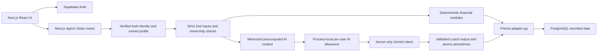

# Stage 7 — Scalability & Integration

Local source audit, 8 October 2026. This is a prototype based on manual/mock records. Stage 6 changes remain intact. No production database, live Gemini, deployment or wallet was contacted for this stage.

Initial audit: `main` at `05d68ad`, matching the recorded `origin/main`; five modified tracked Stage 6 files (README, report, browser suite, frontend-client tests and phase56 route tests), plus untracked `tests/concurrency.test.ts` and `install.cmd`; nothing staged. Status, short/full/summary/name-only/cached diffs and the latest 15 commits were inspected. Initial diff is retained in ignored `coverage/stage7/initial.diff`. No unexpected change was found; fresh pre-edit baseline was 315/315 tests in 27 files. `install.cmd` was not executed or modified (SHA256 `15AA0BD50EA4D4F53DF35B96A6347567CF95231D327F69EAE74ECE23FDE52509`). No AGENTS.md was found in the workspace. Existing safeguards included verified Auth, owned queries, strict schemas, indexed data, Serializable writes, bounded AI context/transport and client pooling; missing application AI protection was the only production-code addition justified by this audit.

## 1. Architecture and trust boundaries

`lib/auth.ts` verifies Bearer/cookie identity using Supabase `getUser`; it does not trust a user ID supplied in JSON. `requireUser` also checks the application profile. Route handlers scope reads/writes to that identity; nested contributions/messages check their owned parent. Zod rejects unknown fields and validates UUIDs, money, dates and bounded page sizes. `lib/api.ts` sanitizes failures and uses no-store envelopes.

Prisma's privileged server connection is a separate boundary from Supabase's direct Data API/RLS. Browser Auth receives public configuration only; DATABASE_URL and Gemini credentials are referenced in server paths, with `server-only` in Gemini and the new limiter. No browser import of Prisma was found. Credentials are not sent to Gemini. Financial formulas, wellness scores, savings plans and purchase verdicts remain in domain modules; AI cannot write transactions, execute payments or change a calculated verdict. Schema-valid AI text can still contradict facts. User messages/history can contain private content even though financial context is minimized.

## 2. API structure and write safety

The existing versioned `/api/v1` route groups cover profiles, categories, transactions, goals/contributions/plans, dashboard, analytics, financial health, simulator, affordability, coach conversations/messages and recommendations. `proxy.ts` checks supported methods; handlers enforce authentication and validation. Responses use `{success,message,data,meta?}`. List pagination defaults to 20, maximum 100; offset pagination remains costly at deep pages.

Contribution and recommendation writes use Serializable transactions. Contribution balance/source capacity and ownership are rechecked inside the transaction. Recommendation transitions use a status guard and same-status no-op. Coach uses committed request-ID replay, an updated-at guard and atomic message/recommendation persistence; identical concurrent uncommitted requests may still generate twice. Profile synchronization uses an owned upsert. General creates/contributions do not have request-ID deduplication or automatic transaction retries. Refresh uncertain writes before retrying. No API redesign was needed; the added application 429 preserves the envelope. Upstream Gemini 429 still maps to the existing sanitized 500 provider-quota message.

## 3. AI request protection

`lib/ai-rate-limit.ts` implements **six generation attempts per rolling 60 seconds per verified user per process**, shared by coach POST and affordability `explain:true`. It runs immediately before generation, after validation, ownership/context preparation and any committed coach replay, outside DB transactions. Provider failures consume an attempt; SDK retries within one generation are not additional application attempts. Calculation-only requests and replay do not consume allowance. Synchronous check/consume has no await gap within a process. Rejection is HTTP 429 with a safe message, null data, no-store and integer `Retry-After`; existing client errors preserve the message and input for deliberate later retry.

Expired identities are pruned, with at most 10,000 active users retained. Capacity fails closed for new identities rather than evicting existing allowances. Cleanup scans the bounded map per attempt; this is a simple prototype tradeoff, not a high-throughput implementation. State resets with process restart/cold start and is **not globally consistent across serverless instances or separately bundled routes**. It does not provide distributed quotas, global spend caps, IP abuse protection or limits on non-AI APIs. Multiple authenticated accounts can each use an allowance. Existing provider timeout/retry bounds remain in place. No Redis/Upstash or new infrastructure was introduced. Production needs a shared atomic limiter/budget policy and observed quota metrics before claiming global protection.

## 4. Database schema and migrations

`prisma/schema.prisma` defines ten application tables, Decimal money, enums, UUID identity and an externally managed Auth reference. Indexes include transaction `(user_id,transaction_date)`/category, goal `(user_id,status)`, contribution `(goal_id,contribution_date)`/transaction, health `(user_id,assessment_date)`, insights `(user_id,created_at)`, conversations `(user_id,updated_at)`, messages `(conversation_id,created_at)` and recommendations `(user_id,status,created_at)`. These align with common scoped queries; no query plans or production index effectiveness were measured.

Primary keys and unique user email exist. SQL supplemental checks cover positive amounts, category/source values and the Auth foreign key. Owned users cascade into their records; goal/conversation deletion cascades children, category deletion restricts transactions, transaction deletion sets contribution references null. Cross-owner goal/source linkage is guarded in application code, not a composite ownership FK. Aggregate allocation/goal limits rely on transactional checks. Financial health snapshots have no unique user/date constraint; repeat refreshes can create multiple snapshots.

There is **no checked-in versioned Prisma migration history**. Existing workflow is reviewed fresh-development `db:push`, supplemental SQL, RLS and category seed; ordinary build only generates the client. Runtime uses DATABASE_URL; CLI uses DIRECT_URL when supplied. Supabase Auth tables/enums are external. No fictitious baseline migration, schema change, index or constraint was added. Future adoption requires inspecting the actual deployed schema, baselining it accurately, reviewing drift and existing rows, then versioning safe migrations on an isolated database. No DB push/reset/seed/migration was run.

## 5. RLS and isolation

Repository SQL enables RLS on all ten application tables, owner SELECT policies on seven directly owned tables, active-category reads and parent-owner policies on contributions/messages. It supplies no Data API write policies. Application Prisma scoping is independently implemented and covered by existing mocked route tests. Supplied policies do not prove deployment, absence of pre-existing permissive policies, role grants or effective isolation with production credentials. Privileged Prisma may bypass RLS and must retain ownership checks.

**Deployed RLS NOT VERIFIED.** `scripts/verify-database.ts` can inspect flags, expected SELECT policy names, constraints and categories against a deliberately selected DB; catalog inspection alone does not prove two-user effective access isolation. No such remote check was run. Production review should include role/privilege inspection and actual authenticated cross-user read/write denial in an isolated environment. No service-role key is required for browser Auth or these handlers.

## 6. Connections and serverless readiness

`lib/prisma.ts` exports one module-level client and reuses a global client during development reloads. PrismaPg uses a pool maximum of five and a 10-second connection timeout. Runtime DATABASE_URL example uses the pooled endpoint; DIRECT_URL example uses the session endpoint for CLI schema work. Actual deployment connection configuration was not inspected. A five-connection per-instance pool can multiply across many instances; module reuse does not create a shared global pool. No connection manager change was justified by local evidence. Future operational work includes provider-compatible pooled URLs/TLS, instance/pool budget, transaction compatibility, acquisition latency and saturation monitoring, plus isolated staging measurements.

## 7. Future authorized MFS integration — DESIGN ONLY

**NOT IMPLEMENTED / NOT CONNECTED TO UPAY / NO LIVE WALLET ACCESS.** No Upay endpoints, OAuth contract, webhook schema or partnership is asserted. Any integration requires provider authorization, documented interfaces and explicit user consent; no credential scraping or unofficial wallet access.

Proposed generic flow: consent and provider-approved authorization → server adapter → payload validation/currency/date normalization → provider/account/external transaction ID deduplication → idempotent owned-record ingestion → existing deterministic engine → optional minimized AI explanation. Existing `source:upay_future` SQL value is a reserved marker; public create inputs allow only manual/mock. The current model has no external provider transaction ID, consent record, connector credentials, ingestion worker or adapter.

Future schema design should use a unique provider/account/external-ID key, versioned mappings and event checkpoints, preserving provenance separately from manual entries. Signed webhooks (if offered), replay protection, durable queues and bounded retries require the provider's real contract. Handle reversals, corrected records, out-of-order delivery, duplicates and periodic reconciliation without double-counting; quarantine invalid events and audit ingest decisions without sensitive payload logs. Isolate provider failure from manual features; revoke consent, stop sync, revoke/expire tokens and define user-visible deletion/retention rules. Keep scoped tokens encrypted server-side, minimize fetched fields and never send provider credentials or full wallet history to AI. None of this is represented as implemented or tested integration.

## 8. Scalability audit

| Area | Existing trait | Remaining bottleneck / future work |
| --- | --- | --- |
| Routes | Request-scoped auth/ownership, persistent DB state, Node handlers | Auth network dependency; limiter is process state; no load validation |
| Dashboard | Batched transaction queries/aggregates, top 20 goals, five insights/recent transactions | Queries share a transaction connection; all-history balance aggregates grow; multiple requests repeat work |
| Lists | Bounded pages with totals; category included in transaction query | Deep offsets/counts/search need query-plan evidence; categories list unbounded but reference data |
| Goals/plans | Scoped goal and rolling grouped spending; no per-goal history loop in dashboard | Health calculations load all noncancelled goals; no limit on lifetime goal count |
| Analytics | Parameterized DB grouping; date ranges bounded to 366 days | Aggregation still scans matching data; no shared cache or background precomputation |
| Simulator/affordability | Deterministic modules; affordability sums in DB; no AI when disabled | Lifetime balance sums and repeated spending reads; no proven throughput |
| Coach | 90-day grouped context, top five categories, six history messages capped at 2,000 chars each | Provider latency/quota, repeated context calculation; simultaneous replay attempts can spend twice |
| Recommendations | Bounded list; generated recommendations capped at three | No retention policy; model text remains qualitative |
| Future ingestion | No current workload or adapter | Bursts require durable backpressure, dedupe and reconciliation before implementation |

No application-level N+1 loop fetching individual transaction records was found in these paths; generation persistence performs at most three recommendation inserts. This is source inspection, not a query profiler. No speculative caching, formula changes or architecture expansion was made. Future priorities should follow staging query plans and metrics: shared AI protection, connection budgeting, expensive aggregate/cursor evaluation, retention, then ingestion infrastructure when a real authorized contract exists.

## 9. Evidence and limitations

| Classification | Evidence |
| --- | --- |
| IMPLEMENTED AND TESTED LOCALLY | Process-local AI rolling allowance and safe 429; offline boundary/isolation/capacity tests and real-handler tests with mocked Auth/DB/provider; existing deterministic, replay/conflict and UI suites |
| IMPLEMENTED BUT NOT PRODUCTION VERIFIED | Auth/scoping, indexed schema definitions, supplemental SQL/RLS definitions, Prisma pool reuse, minimized context and bounded provider transport |
| DESIGNED/FUTURE | Authorized provider adapter/consent/ingestion design; migration baseline; shared limiter, connection and aggregate hardening |
| NOT IMPLEMENTED/NOT VERIFIED | Live Upay/MFS integration, distributed limits, production RLS deployment/effective isolation, production load, database concurrency/connection scalability and live provider quality |

Stage 6 historical evidence remains in README/report. Fresh Stage 7 command results are recorded below after verification; ignored raw logs are in `coverage/stage7/`. Browser tests use synthetic intercepted APIs on a real local build; contribution concurrency is simulated, not a PostgreSQL engine test. No production scalability claim follows from these checks.

Six tests were added: three limiter tests (allow/reject and user isolation/safe envelope, rolling expiry boundary, bounded capacity cleanup) and three handler tests (shared coach/explanation allowance and calculation-only access/second user, failed provider attempts with no persistence, unauthorized/invalid/unowned requests without allowance use). Existing committed replay coverage now asserts that the limiter is not called. The route suite resets a real limiter per test through a mocked exported gate; Auth, Prisma and Gemini remain offline mocks. No fake MFS integration tests were added.

Judge feedback assessment: architecture/API demonstration **ADDRESSED** by the source-grounded flow and boundary map; AI rate protection **PARTIALLY ADDRESSED** by a tested per-process gate without distributed enforcement; authorized ingestion readiness **PARTIALLY ADDRESSED** by an explicit design with no live connector; versioned migrations **NOT ADDRESSED** as implementation (gap and safe baseline strategy documented); concurrent performance **NOT ADDRESSED** as measured production behavior (existing guards/simulated tests do not prove throughput); RLS isolation and serverless connections **PARTIALLY ADDRESSED** by source audit with deployed verification still absent.

### Fresh Stage 7 verification

| Command | Observed result |
| --- | --- |
| `npm.cmd test -- --reporter=json --outputFile=coverage/stage7/baseline-vitest.json` | Pre-edit baseline 315/315 tests, 27 files; exit 0 |
| `npm.cmd test -- tests/ai-rate-limit.test.ts tests/phase56-routes.test.ts` | Focused 34/34 tests, two files; exit 0 |
| `npm.cmd run typecheck` | PASS, exit 0; repeated after final test assertion |
| `npm.cmd run lint` | PASS, exit 0; 0 errors, five existing warnings |
| `npm.cmd test -- --reporter=default --reporter=json --outputFile=coverage/stage7/final-vitest.json` | 321/321 tests, 28/28 files, 0 failed/skipped; exit 0; includes 41 offline AI and 10 simulated contribution tests |
| `npm.cmd run build` | Prisma generation and Next production build PASS; exit 0; no DB provisioning |
| `npm.cmd run test:browser` | 60/60 PASS, desktop 30/mobile 30, 0 skipped, 7.3 minutes; exit 0 |
| `git diff --check` | PASS, exit 0 |

Windows browser teardown stalled after all 60 cases completed; stopping only this run's Next server PID 2696 allowed Playwright to report its real summary and exit 0. This repeats the Stage 6 local infrastructure limitation. Runner/unrelated processes were not terminated. Logs were captured via PowerShell `2>&1 | Tee-Object -FilePath coverage/stage7/<check>.log; exit $LASTEXITCODE`. Final JSON and browser last-run state confirm no failures. Formula/verdict, schema, Auth, dependencies, provider settings and product UI source were unchanged. No commit, push, deployment, live provider/database checks or Stage 8 work was performed.
