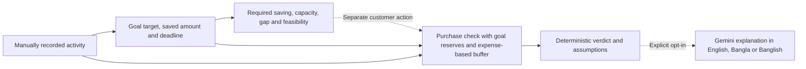

# Stage 9 — Innovation & Competitive Differentiation

Source-grounded review, **8 October 2026 (Asia/Dhaka)**. Scope: the existing customer-focused, MFS-oriented prototype, its combined decision workflow and a conceptual alternative comparison. This is documentation of implemented behavior, not a market survey, customer study, benchmark or new financial model. No named competitor or market-exclusivity claim is made.

## Resume audit

Before edits, ran `git status`, `git status --short`, `git diff`, `git diff --stat`, `git diff --name-only`, `git diff --cached` and `git log --oneline --decorate -15`. The checkout was `main` at `05d68ad`, matching recorded `origin/main`: **14 modified tracked files, seven untracked files, nothing staged**. All Stage 6–8 work was retained. No applicable AGENTS.md was found. The baseline full diff, status, history, documentation copies and SHA-256 hashes of all 161 tracked/untracked files are preserved under ignored `coverage/stage9/`.

Inspected README, the project report, Stage 7/8 reviews, Home/About/Features/How it works/Security, dashboard, goals/Goal Details, planning/affordability, Coach, financial modules, relevant handlers, schemas and existing tests. The concise audit was reported before substantial edits.

| Finding | Evidence and decision |
| --- | --- |
| Existing claims are already bounded | Public pages and README describe two customer decisions, recorded data, optional AI, no live wallet and unvalidated customer impact. Preserve the positioning and UI. |
| Workflow differentiation is described but not compared | README, About and report repeat a short workflow/value statement. Add one canonical source-linked comparison here, with concise links from README/report rather than duplicate matrices across the product. |
| Savings commitments need precise scope | The Savings Plan models one ACTIVE goal and explicitly excludes other-goal reserves. Purchase affordability reserves saved amounts across all noncancelled goals and checks only one selected ACTIVE goal's monthly requirement. Do not describe joint multi-goal optimization. |
| AI explanation has two different contexts | The dedicated purchase explanation receives its calculated assessment. General Coach receives summaries and optional selected-goal facts, not the full Savings Plan result or an automatically calculated purchase verdict. Preserve this boundary. |
| One report limitation is stale | Section 13.2 says per-user AI rate protection is absent and lists it as future work. Stage 7 implemented six attempts/user/rolling minute/process. Correct the report to distinguish that control from missing distributed protection. |
| No novelty or outcome evidence exists | No comparative benchmark, verified customer study, predictive training pipeline, live Upay connector or measured financial improvement was identified. Do not invent them. |

Stage 8's 326 tests/29 files, 60 browser passes, typecheck/build, five lint warnings and limited local audit are **historical Stage 8 evidence**. Fresh Stage 9 results are separately recorded below.

## Actual product contribution

**Recorded activity → savings goal → required saving, capacity, gap and feasibility → reserve-aware purchase assessment → optional multilingual explanation.**

The implemented contribution is bringing these customer questions into one authenticated workspace with explicit recorded-data assumptions. A customer can review what a goal requires, explore a spending-reduction scenario, then independently assess a purchase against recorded cash flow, saved goal funds and an estimated emergency buffer. This can support exploration of the trade-off between a saving intention and a discretionary purchase; improved understanding or behavior is a hypothesis that requires customer evidence.

This is a customer workflow, not automatic transfer of a Savings Plan into the purchase calculator. Both tools read owned recorded data but have distinct calculations: Savings Plan uses a chosen 1–12 × 30-day lookback; affordability uses 90-day averages plus recorded income less expenses to date. Suggested spending reductions are scenarios, not changed transactions or committed savings. Selecting a goal does not automatically coordinate every goal's future saving needs.

The financial workflow works without AI. Optional purchase explanation describes an already calculated assessment; general Coach separately discusses limited recorded summaries and a selected goal. AI does not calculate the authoritative verdict, optimize the full Savings Plan, execute purchases or move funds. These are established ideas combined for a focused use case, not individually novel inventions, a proprietary prediction model or proof of superiority.

## Conceptual alternative comparison

The four columns are **defined configurations**, not findings about all products in a category:

- **A — Basic expense tracker:** recorded entries, totals and categories, without a goal-deadline or purchase-reserve decision model in this defined configuration. Real expense trackers may have richer features.
- **B — Static spreadsheet/budget calculator:** manually maintained inputs, formulas, labels and notes, without a linked application record workflow or generative assistance in this defined configuration. A spreadsheet can reproduce the same formulas, be localized and be extended; none of those capabilities is exclusive to this prototype.
- **C — Calculation-only decision workflow:** this prototype's records, goals, Savings Plan and purchase check with optional explanation off and Coach generation unused. This is an available mode of the same implementation, not a separately built competitor or new feature.
- **D — Current prototype with optional multilingual AI:** the same deterministic workflow, with explicitly requested purchase explanations or separate coaching in the selected language. Added prose is not an improved calculation or verified comprehension benefit.

| Comparison dimension | A — Basic expense tracker | B — Static spreadsheet/calculator | C — Calculation-only workflow | D — Current prototype + optional AI |
| --- | --- | --- | --- | --- |
| Financial-record context | Entered transactions, totals and categories. | Manually entered/copy-maintained values in the defined static setup; formulas can incorporate history if authored. | Owned recorded activity supplies goal-plan and purchase calculations; distinct lookback/balance scopes remain visible. | Same recorded context as C; provider receives limited summaries or the purchase assessment only when requested. |
| Savings commitment visibility | No explicit target/deadline saving requirement in the defined basic setup. | Targets, requirements and gaps can be calculated with suitable inputs/formulas. | Goal requirement, capacity, gaps, scenario budgets, duration and feasibility; purchase reserves all noncancelled saved-goal amounts and optionally checks one ACTIVE goal's pace. | Same quantities and rules as C; coaching may discuss selected-goal facts but receives no complete Savings Plan result. |
| Emergency-buffer assumptions | No purchase buffer in the defined tracker scope. | An expense × months buffer can be represented explicitly; assumptions must be maintained. | Purchase buffer = recorded average monthly expenses × chosen months; it is not a verified emergency account. | Identical buffer to C; AI can describe it but cannot establish liquidity or revise the amount. |
| Purchase-decision support | Balance/spending review; no reserve-aware verdict in this defined setup. | Equivalent available-amount/verdict formulas can be authored; a simple balance-only comparison is also possible. | AFFORDABLE, CAUTION, NOT_AFFORDABLE or INSUFFICIENT_DATA from deterministic recorded-data rules. | Same verdict rules and values as C, with optional prose; language does not set the verdict. |
| Explanation clarity | Amounts/category labels; interpretation depends on the presentation and user. | Formulas, labels and notes can expose reasoning; quality depends on the design. | UI displays arithmetic, required saving/gaps, verdict, assumptions and limitations. Interpretation quality is unmeasured. | Same calculated presentation plus optional generated explanation. Clarity/usefulness improvement is unmeasured; prose can contradict facts. |
| Multilingual assistance | Localized labels/notes are possible; no generative help is assumed. | Localized labels/notes are possible; no generative help is assumed. | Fixed calculation UI; no generated assistance in this mode. | English/Bangla/Banglish choices for purchase explanation and Coach; script/schema checks do not establish fluency or comprehension. |
| Limitations | This deliberately basic scope lacks explicit commitment/buffer logic; richer trackers are outside this comparison. | Input/formula upkeep and user interpretation; a well-designed spreadsheet may suffice and can implement equivalent calculations. | Incomplete records, one-goal Savings Plan assumptions, reserve overlap, estimated buffer and no verified wallet/liquidity or customer outcomes. | All C limitations plus external data processing, quota/latency/failure and potentially false schema-valid prose. Optional explanation failure requires explicit calculation-only retry; no automatic fallback. |

All C/D capability statements are grounded in the source map below. A/B statements describe their chosen scope and possible configurations, not externally tested capabilities or disadvantages. No comparison scores, completion times, accuracy percentages, cost advantages or customer preference results are assigned.

## Source evidence

| Capability / boundary | Actual implementation | Existing verification evidence |
| --- | --- | --- |
| Recorded financial context and local presentation | [transaction validation](lib/validation.ts), [owned transaction routes](app/api/v1/transactions/route.ts), [Dhaka periods/aggregates](lib/analytics.ts), [dashboard](<app/(workspace)/dashboard/page.tsx>). Manual/mock source, BDT and Asia/Dhaka; no wallet connector. | [finance/schema tests](tests/finance.test.ts), [owned routes](tests/routes.test.ts), [period/aggregation tests](tests/phase3-calculations.test.ts). |
| Goal requirement | [goalData](lib/finance.ts) computes remaining amount and required monthly saving; [goals](<app/(workspace)/goals/page.tsx>) and [Goal Details](<app/(workspace)/goals/[id]/page.tsx>) display goal context. | [goal arithmetic tests](tests/finance.test.ts), [Savings Plan UI tests](tests/savings-plan-ui.test.ts). |
| Capacity, gaps, budgets and feasibility | [savingsPlan](lib/savings-plan.ts), [owned ACTIVE-goal handler](<app/api/v1/goals/[id]/savings-plan/route.ts>) and Goal Details. Includes `reservesForOtherGoals: false`; uniform customer-chosen category-reduction assumption. | [Savings Plan arithmetic](tests/phase3-calculations.test.ts), [route scoping](tests/phase3-routes.test.ts), [returned result/assumption UI](tests/savings-plan-ui.test.ts). |
| Goal reserves, expense buffer and purchase verdict | [affordability](lib/projections.ts), [assessment handler](app/api/v1/affordability/check/route.ts) and [Planning UI](<app/(workspace)/planning/page.tsx>). Handler sums all noncancelled goal savings; only selected ACTIVE goal adds monthly requirement. | [reserve/buffer/verdict tests](tests/phase56-calculations.test.ts), [calculation-only/owned route tests](tests/phase56-routes.test.ts), [explainability UI tests](tests/affordability-ui.test.ts). |
| Optional explanation, same financial source of truth | Assessment handler calls [Gemini](lib/gemini.ts) only for `explain:true`, passing the calculated assessment and returning explanation beside unchanged fields. [schema](lib/phase56-validation.ts) defaults explanation off. | Phase 5/6 route tests verify no provider call by default, fixed assessment serialization, explicit recovery after provider failure and immutable facts despite falsely approving prose. |
| Multilingual coaching scope | [minimizedContext](lib/coach-context.ts), [message handler](<app/api/v1/coach/conversations/[id]/messages/route.ts>), [Coach UI](<app/(workspace)/coach/page.tsx>), Gemini and [script check](lib/coach-language.ts). General chat has summaries/selected-goal facts, not complete plan/verdict context. | [offline AI evaluation](tests/ai-evaluation.test.ts), [synthetic cases](tests/fixtures/ai-evaluation.ts), [language checks](tests/coach-language.test.ts), [context/privacy tests](tests/responsible-ai.test.ts). |
| Remaining safety/production limits | [Stage 7](STAGE7_SCALABILITY_INTEGRATION.md), [Stage 8](STAGE8_RESPONSIBLE_AI_SECURITY.md), [process-local limiter](lib/ai-rate-limit.ts), [wellness emergency proxy](lib/financial-health.ts). | Local/mocked tests do not prove deployed RLS, live Gemini security/quality, production scalability, provider erasure or customer impact. |

## Concrete synthetic examples already in the tests

These are two independent authored unit-test fixtures, not a newly conducted customer experiment or one integrated live account. Their fixed January–March 2026 reference period is deliberate test data, not a current-date estimate.

**Savings example:** the existing `Savings plan arithmetic` case uses a BDT 1,000 goal, BDT 100 recorded saved amount, 30 June 2026 deadline, and 90-day income/expense totals of BDT 3,000/2,700. It returns required monthly saving **300**, available saving **100**, original gap **200**, and, under a 10% category reduction, projected monthly saving **190**, remaining gap **110**, estimated duration **five months**, and deadline feasibility **false**. The useful distinction is between a recorded target, saving capacity and deadline feasibility; the scenario does not promise achievement. [Fixture and assertions](tests/phase3-calculations.test.ts).

**Purchase example:** the existing purchase fixture supplies recorded balance **2,500**, saved-goal reserve **100**, average monthly recorded expenses **500**, and a three-month estimated buffer **1,500**. Available for purchase is **900**. A purchase of **2,000** therefore produces **CAUTION** even though it fits the recorded balance; **3,000** produces **NOT_AFFORDABLE**. This demonstrates the reserve/buffer distinction in the implemented rules, not superiority over a tracker or spreadsheet. [Fixture and assertions](tests/phase56-calculations.test.ts).

Calculation-only and optional-AI modes retain the same financial rules. Existing handler tests show that added falsely reassuring prose cannot change those fields, while also demonstrating that such prose may still be accepted. No real Gemini answer, favorable customer reaction or comprehension gain is fabricated.

## Claim boundaries and future evaluation

Supported statements: the prototype combines recorded-data goal planning and reserve-aware purchase support; exposes required saving/capacity/gaps/feasibility and purchase assumptions; and offers optional selected-language assistance while retaining deterministic numerical authority. MFS orientation is supported by local currency/dates and manually recorded activity labels, not a live integration or demonstrated MFS-specific advantage.

Unvalidated hypotheses: the connected presentation and optional explanation may help customers explore decisions or interpret assumptions. Do not translate those hypotheses into improved saving, spending reduction, financial independence, customer retention, Upay revenue, language-comprehension gains or market superiority.

Do not claim first-of-its-kind ideas, exclusive features, a novel financial/ML algorithm, predictive training, measured accuracy/performance, verified customer demand, automatic wallet ingestion, factual AI verification or prompt-injection immunity. Goal reserves and expense buffers are recorded assumptions, not funds physically protected by the system. Stage 8's privacy, retention/deletion, emergency-proxy and production-security limitations remain unchanged.

The [existing customer-study framework](FINAL_PROJECT_REPORT.md#131-customer-impact-and-validation) and [offline AI review protocol](FINAL_PROJECT_REPORT.md#93-factual-language-and-recommendation-review) remain future evaluation designs. A fair future comparison would use matched records/goals/purchase inputs, equivalent formulas where possible, frozen reference dates and explicit A/B setup assumptions. Compare C/D with the same deterministic facts and selected language; record provider failure, incorrect prose and practice/order effects rather than counting generated text as success. Score interpretation accuracy, time/errors and usefulness separately from confidence/preference. No study or benchmark was conducted in Stage 9.

## Changes and preservation

- Added this canonical audit, workflow, seven-dimension comparison, source map and claim boundaries.
- Updated README with the precise workflow and comparison link.
- Updated the project report's workflow diagram and comparison framing, and corrected the stale rate-limit limitation/future-work wording.
- Left public/workspace UI, financial formulas/verdicts, transaction/goal/Auth behavior, Stage 7 allowance, Stage 8 controls/tests, model/provider settings, dependencies and schema unchanged. No test was added, removed or renamed.

`install.cmd` was preserved and not executed. No reset, clean, restore, commit, push, deployment, live Gemini/paid API, database provisioning or customer contact occurred. The final judge-feedback audit, deployment and demo preparation remain later work.

## Fresh Stage 9 verification

Executed fresh on **8 October 2026**, using the existing test inventory. Full-suite and source/handler evidence establish implementation behavior, not customer clarity, model quality, competitive superiority or financial impact.

| Command / check | Fresh Stage 9 result |
| --- | --- |
| `npm.cmd run typecheck` | PASS; exit 0 |
| `npm.cmd run lint` | PASS; 0 errors, five existing warnings; exit 0 |
| `npm.cmd test -- --reporter=default --reporter=json --outputFile=coverage/stage9/vitest.json` | **326/326 tests, 29/29 files PASS; 0 failed/skipped**; exit 0 |
| `node scripts/audit-project.ts` | PASS; 136 source files, 18 inspected commits, no import/secret-pattern findings; exit 0. Limited local review, not a complete security audit. |
| `node coverage/stage9/check-links.mjs` | **45 local links/heading references checked, zero broken** across this report and incoming README/project-report links; exit 0 |
| Resume-file preservation | 161 baseline files compared: only README/project-report changed; **159 unchanged**. This Stage 9 report is the only added project file. |
| `git diff --check` | PASS after documentation finalization; exit 0 |
| Production build / mocked desktop/mobile browser | **Not rerun in Stage 9.** Stage 8 build PASS and 60/60 browser cases remain historical; application, tests, dependencies and build/browser configuration are unchanged. |

Command output, captured exit codes, Vitest JSON, link results and final summary are retained under ignored `coverage/stage9/`. No tests were added to increase the pass count. No live Gemini, paid API, production service or customer evaluation was invoked.

## Final Git status and verdict

The checkout remains `main` at `05d68ad`, matching recorded `origin/main`: **14 modified tracked files, eight untracked files and zero staged changes**. The extra untracked file is this Stage 9 report. Earlier Stage 6–8 files, including the untouched Stage 7/8 reviews and `install.cmd`, are preserved. No commit, push or deployment occurred.

Stage 9's requested source-grounded differentiation and conceptual comparison are complete. The defensible contribution is the combined recorded-data decision workflow and optional language assistance. Actual competitive advantage, customer outcomes, live multilingual quality and production readiness remain unvalidated; individual components are not claimed as novel inventions.

STAGE 9 COMPLETE — READY FOR REVIEW
